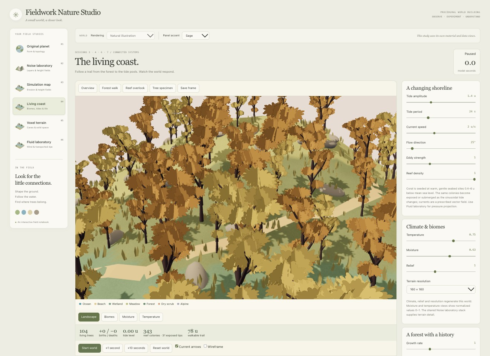

# Procedural World Building

Student project for Cornell Tech **Procedural World Building**.

I am learning to build a procedural planet in the browser using React, TypeScript, and Three.js. My notes record the prompts I try, the changes I observe, and screenshots of each experiment.

## Explore the project

- [Planning and feature backlog](docs/planning/backlog.md)
- [Tutorials and learning path](docs/tutorials/00%20-%20World%20Building%20Learning%20Path.md)
- [Assignment 1: voxel terrain tutorial and plan](docs/tutorials/06%20-%20Assignment%201%20-%20Voxel%20Terrain,%20CSG%20and%20Meshing.md) — foundations; see Tutorial 12 for the implemented voxel study
- [Inspiration gallery and reference library](docs/library/README.md)
- [Analysis notes](docs/analysis/README.md)
- [Application source](app/)

## Current progress

**As of 2026-10-07**, the app has six workspaces:

- **Original planet:** sine-based radial terrain, UV sphere / icosphere comparison, and smooth or faceted shading.
- **Noise laboratory:** seeded Perlin, Cellular and Sine layers, shaping, blending, and linked 2D/3D previews.
- **Simulation map:** a shared-noise height field, keyboard exploration, and simplified hydraulic erosion with rain painting, storms, batch steps and diagnostic views.
- **Living coast:** climate-driven biomes, tides, fixed reef colonies, current vectors, terrain-aware A* trails and a growing L-system forest.
- **Voxel terrain:** 3D density shapes, ordered CSG, Marching Cubes, density slices and local chunk rebuilding.
- **Fluid laboratory:** prescribed wind and a separate 2D advected-dye model with pressure projection.

The current checkpoint is **Fieldwork / Nature Studio**: a warm-paper research interface with study navigation, a central world viewport and grouped inspectors. **Natural illustration** is the new default. The world keeps blue water, green vegetation, earth and rock colors independently of the interface accent. The earlier Illustrated map remains selectable for comparison.

Simulation map adds tree/terrain shadows, restrained distance fog and depth-based coloring for Explore water. Its vegetation inspector controls density, clustering and size and reports actual placed trees. These are distribution rules, not population growth.


[Tutorial 08](docs/tutorials/08%20-%20Nature%20Studio,%20Shadows%20and%20Tree%20Distribution.md) explains the redesign and tree controls. The [October 7 log](docs/tutorials/2026-10-07%20-%20Progress%20Log.md) records the original checkpoint and the new local experiment with screenshots and checks. The [Visual Changelog](docs/tutorials/Visual%20Changelog.md) preserves earlier iterations.

The new [Connected Worlds tutorial](docs/tutorials/12%20-%20Connected%20Worlds%20-%20Coast,%20Caves%20and%20Living%20Forests.md) explains the implemented systems and real parameter trials. Living coast adds branching trunks, textured leaf clusters, grass, rocks, shadows and depth-aware water; it retains separate biome and climate diagnostics. Simulation map remains a separate hydraulic experiment.



Tab navigation now retains mounted study state and pauses hidden studies. Reloading still resets runs. Tides and coast currents are prescribed, coral placement is static, and the fluid solver is bounded 2D; no 3D cave water or complete weather model is claimed. See the [backlog](docs/planning/backlog.md) for remaining work and [style guide](STYLE-GUIDE.md) for visual boundaries.

## Course checkpoint — Sessions 3–7

- [New progress report: screenshots, improvements and parameter experiments](docs/tutorials/2026-10-07%20-%20Nature%20Studio%20Course%20Progress.md)
- [Learning insights for all five sessions](docs/tutorials/2026-10-07%20-%20Learning%20Insights%20-%20Sessions%203%20to%207.md)
- [Session 5: Voxels and Spatial Density](docs/tutorials/09%20-%20Session%205%20-%20Voxels%20and%20Spatial%20Density.md)
- [Session 6: Vector Fields, Fluids and Atmosphere](docs/tutorials/10%20-%20Session%206%20-%20Vector%20Fields,%20Fluids%20and%20Atmosphere.md)
- [Session 7: L-systems, Growth and Ecosystems](docs/tutorials/11%20-%20Session%207%20-%20L-systems,%20Growth%20and%20Ecosystems.md)

The earlier report preserves the pre-implementation checkpoint. [Tutorial 12](docs/tutorials/12%20-%20Connected%20Worlds%20-%20Coast,%20Caves%20and%20Living%20Forests.md) is the current implementation record: Sessions 5–7 now have working volume, vector-field and vegetation models, with explicit limitations and measured trials.

## Run locally

With Node.js and npm installed:

```bash
cd app
npm install
npm run dev
```

Open the local URL printed by Vite in the terminal.

Validation from `app/`: `npm run build`, `npm run lint`, and `npm run test:simulation` (the simulation tests need a Node.js version that supports `--experimental-strip-types`).

## Repository layout

```text
app/                React + TypeScript + Three.js sandbox
docs/planning/      Feature backlog and plans
docs/tutorials/     Learning notes, visual changelog, and screenshots
docs/analysis/      Observations, comparisons, and rejected experiments
docs/library/       Inspiration gallery and reference reading
STYLE-GUIDE.md      Design direction and palette tokens
```

The tutorials are also accessible through my Obsidian vault. Images stay beside the tutorials in `images/`.
