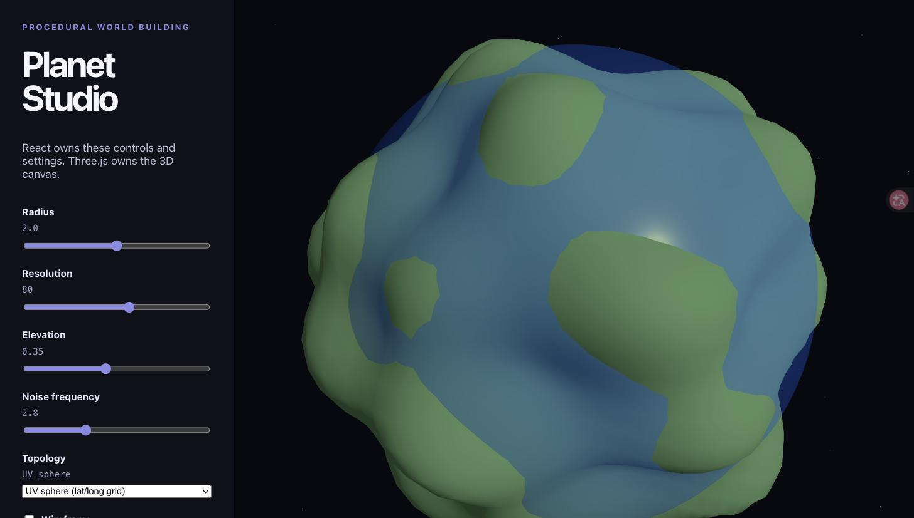
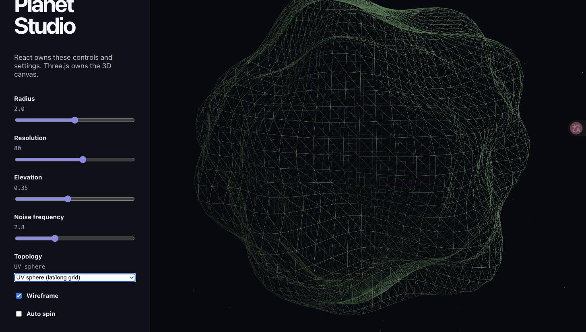
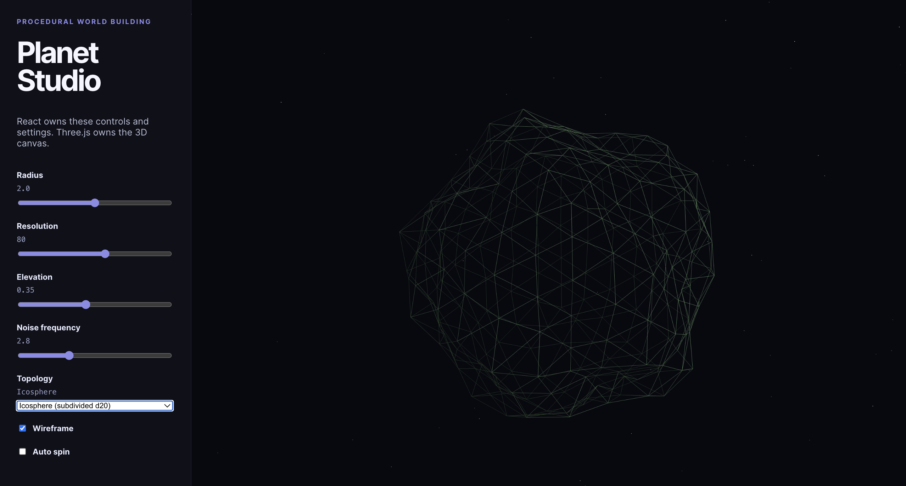

# 01 — Geometry & Topology for Planets

> **Previous:** [[00 - World Building Learning Path]] · **Next:** [[02 - Textures, UVs & Heightmaps]]

## 1. The vocabulary (5 terms, that's all)

Every 3D object is a **mesh**, and a mesh is just:

- **Vertex** — a point in 3D space `(x, y, z)`
- **Edge** — a line between two vertices
- **Face** — a triangle made of three vertices (GPUs only ever draw triangles)
- **Normal** — a direction arrow on each vertex/face saying "this way is *outward*" — lighting depends entirely on this
- **Topology** — *how* the vertices are connected. Two meshes can have identical shapes but different topology.

Why topology matters for us: **procedural generation edits vertices with code**. Bad topology = stretched textures, lighting seams, and terrain that deforms unevenly.

## 2. The sphere problem (the heart of week 2)

You can't wrap a grid around a sphere without distortion — this is the same reason all flat world maps lie. There are three classic sphere topologies:

| Topology | How it's built | Pros | Cons |
|---|---|---|---|
| **UV sphere** | latitude/longitude grid | simple, default `SphereGeometry` | vertices crowd at the poles → pinching, stretched textures |
| **Icosphere** | subdivided icosahedron (d20 dice) | nearly uniform triangles | no natural rows/columns, harder to map a grid onto |
| **Cube-sphere** | subdivided cube, vertices pushed onto sphere | 6 clean square faces → great for heightmap tiles & LOD | slight distortion at cube corners |

Most planet renderers (and this course) end up on **cube-sphere**, because each of the 6 faces is a neat grid you can tile, texture, and stream.

## 3. See it yourself (15-min exercise)

In your Vite + Three.js sandbox, render the same sphere twice in wireframe:

```js
import * as THREE from 'three';

const mat = new THREE.MeshBasicMaterial({ wireframe: true, color: 0x44aa88 });

// UV sphere — look at the poles!
const uvSphere = new THREE.Mesh(new THREE.SphereGeometry(1, 24, 16), mat);
uvSphere.position.x = -1.5;

// Icosphere — uniform triangles everywhere
const icoSphere = new THREE.Mesh(new THREE.IcosahedronGeometry(1, 3), mat);
icoSphere.position.x = 1.5;

scene.add(uvSphere, icoSphere);
```

**Predict first, then look:** where do triangles bunch up on each one?

## 4. Touch the vertices (the procedural "hello world")

Terrain generation is literally this — moving vertices outward by some amount:

```js
const geo = new THREE.IcosahedronGeometry(1, 4);
const pos = geo.attributes.position;

for (let i = 0; i < pos.count; i++) {
  const v = new THREE.Vector3().fromBufferAttribute(pos, i);
  const bump = 1 + 0.1 * Math.sin(v.y * 10);   // ← your "algorithm"
  v.normalize().multiplyScalar(bump);
  pos.setXYZ(i, v.x, v.y, v.z);
}
pos.needsUpdate = true;
geo.computeVertexNormals();   // recompute lighting after deforming!
```

Swap `Math.sin(...)` for **noise** later and you have a planet. That one-line swap is basically week 1 of the course.

> [!warning] Two things everyone forgets
> `pos.needsUpdate = true` (GPU won't see your edits) and `computeVertexNormals()` (lighting stays wrong without it).

## 5. Voxels — the other topology (week 3)

Meshes describe **surfaces**; voxels describe **volume** (Minecraft-style 3D grid of filled/empty cells). Voxels make caves and overhangs trivial — heightmap meshes can't do either. The workflow: store a 3D grid → extract a surface mesh from it (culled cubes, or marching cubes when you're ready).

## 6. Ask-the-AI prompts

- *"Render a UV sphere and an icosphere side by side in wireframe and explain the pole pinching I see."*
- *"Explain cube-sphere mapping like I'm building a planet renderer. Why does everyone use it for LOD?"*
- *"My deformed sphere's lighting looks faceted/broken — here's my code."* (paste it — it's probably normals)

## My progress — 2026-09-02 ✅

**Prompt used:** *"Add a wireframe toggle to Planet Studio, then let me switch between SphereGeometry and IcosahedronGeometry to compare pole pinching."*

**What changed in `app/src/App.tsx`:**

- Added `topology: 'uv' | 'ico'` and `wireframe: boolean` to `PlanetSettings`
- `buildPlanetGeometry()` now branches: `SphereGeometry` vs `IcosahedronGeometry`. The resolution slider (16–128) maps to icosphere detail 1–6, because each detail step **quadruples** the triangle count
- New UI: a Topology dropdown + Wireframe checkbox
- Wireframe mode also hides the transparent ocean shell — otherwise it covers the mesh you're trying to inspect

### Step 1 — where I started

This is the Planet Studio I already had: UV sphere, fake sine noise, ocean shell on top. Looks fine… until you ask what the mesh underneath actually looks like.



### Step 2 — turn on wireframe (UV sphere)

Wireframe on, auto-spin off. And there it is — the latitude/longitude grid, with the quads visibly squeezing together at the top pole. The "pole pinching" from section 2, but on *my* planet, not in some textbook figure.



> honestly I didn't expect it to be THIS obvious. the top of the sphere looks like fabric being pulled into a drawstring bag. every tutorial says "vertices crowd at the poles" but seeing my own terrain get denser up there for no terrain-related reason made it click.

### Step 3 — same planet, different topology

One dropdown change: `SphereGeometry` → `IcosahedronGeometry`. Same radius, same noise, same elevation.



> two things I noticed while flipping back and forth: (1) there is just… no pole. no special point anywhere, the triangles are boringly uniform, which is exactly the point. (2) the planet's silhouette actually CHANGED even though I didn't touch the noise sliders — took me a minute to realize the noise is sampled *at the vertices*, and the vertices moved. so "same algorithm, different topology" ≠ same shape. sneaky.

> also, small confession: the first wireframe screenshot looked wrong because the "ocean" was still covering everything. I genuinely thought water was somehow part of the planet mesh. it's not — it's literally a second, slightly bigger sphere wearing the planet like a coat. hiding it in wireframe mode was the fix.

**Bonus lesson (React, found by accident):** while automating the browser we set the checkbox's DOM value directly and *nothing happened* — the box looked checked but the planet didn't change. A real mouse click worked. Reason: this is a **controlled component** — the DOM checkbox is just a picture of React state; only an `onChange` event actually updates the state that Three.js reads. Screen ≠ state.

> (the AI called this "screen ≠ state" and I'm keeping that phrase. the checkbox was checked. the app disagreed. rude.)

## What surprised me

- The ocean is a separate sphere. Still not over it.
- Switching topology while keeping every slider identical produces a *differently-shaped* planet, because the noise gets sampled at different vertex positions.
