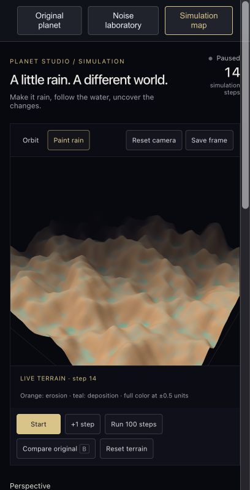

# Simulation Map and Hydraulic Erosion

## Prompt

Add a simulation map driven by my noise stack, with start/stop, height-based materials, keyboard navigation, and a wireframe shortcut. Add hydraulic erosion as a new perspective.

## Today’s progress record

Follow the [September 9 log](2026-09-09%20-%20Progress%20Log.md) for the prompt sequence, five screenshots, and the questions about low-poly shading and simulation time.

Orange = erosion; teal = deposition. This screenshot is a view of the retained current experiment, not a new run.

## Try it

1. Edit the noise stack in **Noise laboratory**. The stack and Solo selection are shared with Simulation map.
2. Open **Simulation map**. Explore mode uses a moving 192-unit window with deterministic world-coordinate sampling.
3. Click **Start**, click the terrain to move keyboard focus away from controls, then use WASD or arrow keys. F toggles wireframe; Space starts/stops. Shortcuts do not intercept form controls.
4. Select **Hydraulic erosion** (now the default perspective). This locks exploration to a fixed window. Start adds rain and advances flow, erosion, deposition, and evaporation in discrete steps.
5. Pause to inspect the result. Use the Water view to inspect surface water; the height map uses the same ground samples as the terrain. Reset terrain restores the noise-generated starting point.

## What is actually implemented

Height colors distinguish low areas, beaches, vegetation-colored elevations, rock and snow. These are visual elevation bands, not a climate/biome simulation.

The erosion model moves water toward the lowest neighboring surface, transports sediment, erodes when carrying capacity exceeds sediment load, deposits excess sediment, and evaporates water. Closed boundaries retain runoff. It is an educational grid model, not a calibrated geological or fluid solver. Coastline water in Explore mode is a separate visual plane.

## Calibration experiment

Compare 64, 96 and 128 segments with the same stack and relief. The map matches the mesh resolution. The sampling panel estimates whether the finest nominal noise scale has four samples; modifiers can require more. Lower high-frequency noise before raising resolution indefinitely.

A different resolution changes the erosion discretization. Equal step counts at different resolutions are not physically equivalent. Rain and height use arbitrary world units, and each step has no real-world time calibration.

## Current limits

Changing terrain calibration or the stack restarts the field. Rainfall changes now preserve the field. Leaving the Simulation map tab resets this workspace. Exploration streams a bounded window rather than storing an infinite world; erosion is local and is not saved into world chunks. Heavy Cellular stacks can be slower. Hand tracking is a future idea and no webcam is accessed.

## Verification

Build and lint passed. A 300-step numerical check verified finite elevations, nonnegative water, visible height changes, and approximate conservation of terrain plus sediment. Browser Start/Stop was exercised and stopped at 90 steps. Keyboard navigation and longer erosion outcomes still deserve hands-on comparison.

## My observations

Record after trying: What changed? Did water collect where expected? At what scale did the terrain stop looking convincing? Add before/after screenshots from the same camera and resolution.

## Playground update — 2026-09-09

**Prompt:** “Make it more playful and interesting.”

This pass makes the experiment easier to manipulate and inspect. It does not replace the hydraulic solver with a physically calibrated one.

### A two-minute experiment

1. Choose **Paint rain** and click one visible hill. This adds a local water pulse; the gold ring marks the click. Choose **Orbit** to rotate the scene again.
2. Switch to **Water**. Blue shows accumulated water depth, scaled from 0 to 1+ world units. Set Weather to Dry if you want only the water you added.
3. Click **Run 100 steps**. The simulation pauses automatically after 100 additional steps. **+1 step** advances only once.
4. Switch to **Ground change**. Orange means ground was removed; teal means it was deposited. Color saturates at ±0.5 world units. The relief itself is not exaggerated.
5. Toggle **Compare original** (B). It shows the original ground at the same camera angle, pauses evolution, and retains the current result. Click again to return.
6. Try **Make it rain**. A storm adds 0.060 rain units per step for 50 simulation steps, on top of the Weather setting. Afterward, ordinary simulation continues until paused. The storm works even with Weather set to Dry.
7. **Save frame** initiates a PNG download with the view, step, grid resolution, relief, and rainfall labels. Save paired original/current frames alongside the notes. It is a rendered terrain capture, not a screenshot of the entire UI or a reloadable simulation save.

### What the numbers mean

- Deepest cut: largest decrease from the initial height field.
- Largest deposit: largest increase from the initial field.
- Ground changed: fraction of samples changed by more than 0.01 world units.
- Mean surface water: average water depth across all samples.

These always describe the current simulation, even while the original preview is visible. The zero-step preview in Ground change view is neutral because it has zero difference from itself.

### Rendering changes

Smooth lighting replaces per-face lighting. Elevation colors blend between bands, while dedicated water and change views isolate the phenomenon being inspected. The dark/sand UI remains. On narrow screens, the terrain and playback controls appear before the longer settings; they no longer overlap.

### Verified during development

- Rain painting increased water locally without advancing the simulation.
- Run 100 steps paused at step 100; +1 step advanced to 101.
- Changing Weather to Dry retained step 101 and the current terrain.
- Compare original disabled evolution controls and returned to the preserved result.
- F toggled wireframe.
- A 50-step storm ran with dry background weather and subsequently returned to dry conditions.
- TypeScript build and lint passed. Four automated tests cover rain locality, erosion conservation, evaporation, and difference measurements (`npm run test:simulation` from app/).

A test reached step 247 with a maximum cut of about 3.309 units and maximum deposition of 5.429 units. This is an implementation test, not a claim that the user ran it or evidence of geological realism. Five real progress screenshots have now been saved in the [September 9 progress log](2026-09-09%20-%20Progress%20Log.md). Those images show the paused step-14 experiment, separately from the development test at step 247. The Save frame action requests a PNG download, but file delivery could not be verified in the in-app browser.

### My next observation

_To be written after trying it: where did I expect water to collect, and where did it actually collect?_
