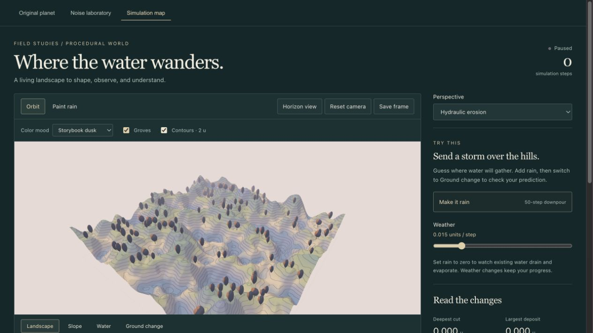
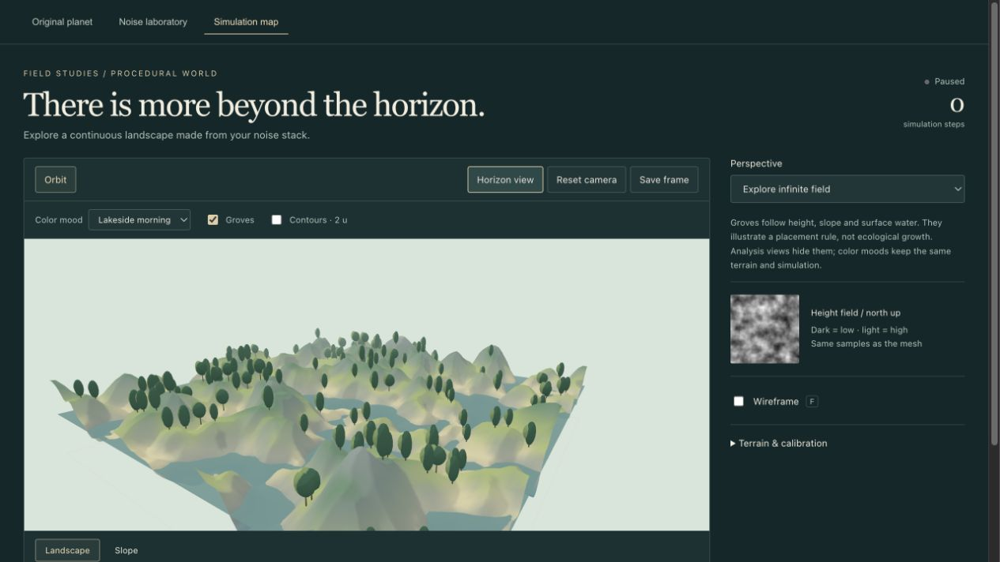

# Stylized Landscapes and Procedural Detail

> **September 17 interface update:** the app now separates interface accents from natural world materials, with optional colored contour/stipple overlays. Earlier screenshots and mood names below record the previous iteration. See [[07 - A Consistent Visual Language for Procedural Worlds]] for current controls and [[2026-09-17 - Progress Log]] for new screenshots.

## The question

How can a world feel like an illustrated game while still showing the procedural work behind it?

Keep the underlying rules specific and make their visual presentation deliberate. A smooth green hillside can still have a sampled height field, a measurable slope, an erosion history, and a rule that decides where trees appear.

## 1. Separate shape from appearance

Open Simulation map. Choose **Lakeside morning**, then **Storybook dusk** under Color mood.

The colors of the ground, sky, water plane, and groves change. The mesh heights and simulation fields do not. This distinction makes it possible to compare an art decision without accidentally changing the experiment.

> Small note: A nicer palette should not count as improved terrain generation. Check the shape separately.

## 2. Read the land in layers

**Landscape** combines elevation color, slope-dependent rock color, broad lighting bands, and distance haze. **Slope** shows the steepness of the same terrain directly. The display ranges from pale green at 0 degrees to plum at 60 degrees or more.

For an interior grid sample, horizontal rise/run is the difference between the right and left neighbors divided by their distance. Repeat in the other direction, combine the two gradients, and take the arctangent to obtain the slope angle. At the boundary, use the available neighbors and their actual separation.

Turn on **Contours · 2 u** in Landscape. Each line follows a multiple of 2 world-height units. Closely packed contour lines indicate steeper ground. These are drawn from the mesh height, not pasted on as a texture.

> Small note: Contours make the softened landscape easier to explain without turning the entire scene into wireframe.

## 3. Make vegetation placement explainable

Turn **Groves** off and on. The current placement rule:

- Generate repeatable candidate locations in world coordinates, with clustered density.
- Keep candidates between sea level +2 and sea level +21 units.
- Reject slopes above 0.7 rise/run (about 35 degrees).
- Reject samples with more than 0.3 units of accumulated water in the current field.
- Anchor trees at the selected height samples and vary their proportions deterministically.

The same field and coordinates produce the same candidates. Changing the color mood does not scatter the trees again. During erosion, placement is re-evaluated; trees can disappear or return when thresholds change. That is a visualization of a rule, not gradual ecological growth.

> Small note: The useful question is “Why is this tree here?” An answer involving the terrain is stronger than “It looked empty.”

## 4. Inspect behavior without decoration

Use **+1 step**, then compare **Water** and **Ground change**. Diagnostic colors are unlit and independent of the mood. Groves are hidden automatically. Ground change still measures the difference from the original ground; Water still displays accumulated depth.

Press **F** with viewport focus to inspect triangles. The number of samples has not increased just because the lighting is smoother.

## 5. Compare at a fixed resolution

The default square is 192 units wide with 96 segments in each direction: spacing is 2 units, there are 97 × 97 height samples, and 18,432 triangles. Fine visual shading cannot recover features smaller than the grid can sample reliably.

For a separate calibration experiment, compare 64, 96, and 128 segments using the same noise stack. Changing resolution resets the simulation, so take your current screenshots first. Equal step counts at different grid spacings are not equal amounts of geological time.

## 6. Build a stronger composition next

Use **Horizon view** for a lower angle. For the separate Explore perspective, the water plane shows a sea-level shoreline. It is not the hydraulic water simulation.

Next, design a noise recipe with a larger basin, a recognizable ridge, and quieter areas between details. Then decide which vegetation belongs in each area. More random detail is not automatically a more convincing place.

## Try this prompt

> Keep the illustrated landscape style. Propose a repeatable noise recipe with one large basin and readable ridges. Explain which layer makes each landform. Compare the same field in Landscape, Slope, and contour views, and save actual screenshots with a brief English explanation. Do not change the erosion solver merely to improve the image.

See the [progress log](2026-09-10%20-%20Progress%20Log.md) for what was actually tested. These are useful ways to demonstrate procedural reasoning; the current course grading rubric has not been verified in this update.
