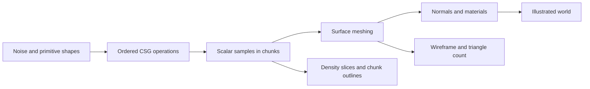

# Assignment 1 — Voxel Terrain, CSG, and Meshing

> Later implementation update: the new voxel, fluid and ecosystem studies are now available. See [Tutorial 12](12%20-%20Connected%20Worlds%20-%20Coast,%20Caves%20and%20Living%20Forests.md) for the current scope, screenshots and results. This note retains the earlier checkpoint and proposed experiments.

> This note explains the supplied assignment and proposes experiments for the current app. The Voxel Terrain tab, density editor, mesher, and chunk manager are not implemented yet. All result fields below are deliberately left for actual experiments.

## What the assignment is asking

Build a separate Voxel Terrain tab; explore density shapes and sequential operations; explain size/performance limits and chunking; implement a surface mesher such as Marching Cubes; discuss alternative meshers; and investigate voxel optimizations.

The brief says “CS techniques — sequential operations.” In this context, this note interprets that provisionally as **CSG: Constructive Solid Geometry**. The abbreviation should be confirmed against the instructor's original wording. CSG is not the same thing as the Noise laboratory's layer blend controls, though both have an ordered stack.

The useful learning outcome is to explain how a shape becomes sampled data, how that data becomes a visible surface, and why the implementation remains responsive as the world grows.

## 1. Start with the world that already exists

The current Simulation map stores one height for each horizontal location:

```text
y = H(x, z)
```

Its default grid covers 192 × 192 world units, uses 96 × 96 cells and 97 × 97 height samples, and renders 18,432 triangles. Its hydraulic model stores ground, water, and sediment on that same horizontal grid. These are observations from the current source, not an assessment of the completed assignment.


*Existing baseline, reused from the September 10 log. This is not a voxel result or a new September 16 screenshot.*

A height field can make hills, ridges, valleys, and a sea-level shoreline. It cannot represent a cave floor and cave ceiling at the same horizontal coordinate within that one surface. Raising resolution cannot remove this representation limit.

A volumetric scalar field answers a different question:

```text
f(x, y, z) < 0  → solid
f(x, y, z) = 0  → surface
f(x, y, z) > 0  → air
```

We will use this negative-inside convention throughout the tutorial. Some libraries use the opposite convention, so check the adapter rather than mixing signs.

**Voxel** describes a volume element; it does not require a block-shaped final image. For the proposed mesher, scalar values are stored at grid vertices, and each cell spans eight neighboring samples. A debug view may show cubes; the final mesh can look smooth and illustrated.

> Small note: A cave requires another way of describing the world, not just another material on the current plane.

## 2. Follow the full pipeline



Noise creates variation. CSG combines solids. Sampling gives the computer a finite dataset. Meshing builds the visible boundary. Materials decide how the boundary looks. Chunking organizes where data and work are needed; it is not itself a shape or meshing algorithm.

## 3. Explore density shapes before making a whole world

Use one small bounded volume and a fixed seed. Start with 32 cells per axis, meaning 33 scalar samples per axis for a corner-sampled grid. This is a proposed starting budget, not a measured performance guarantee.

**Sphere.** For center `c` and radius `r`, use `f(p) = length(p - c) - r`. Change the radius, then inspect a density slice. This is an exact signed distance function: the magnitude describes distance to the sphere surface.

**Box.** Use an axis-aligned box signed distance function. This makes straight sides and corners useful for comparing how meshers handle sharp features. Translating, scaling, and rotating shapes can later become editor controls.

**Capsule.** Measure the distance from a point to a finite line segment, then subtract a radius. A horizontal capsule makes a useful tunnel cutter. It is easier to control than expecting random noise to produce a connected cave.

**Terrain-shaped volume.** Reuse the current height function:

```text
fTerrain(x, y, z) = y - H(x, z)
```

Below the surface the value is negative; above it the value is positive. This describes a solid below the current landscape, but it is generally not an exact signed distance field. That distinction matters for distance-based effects, even though its zero surface can still be meshed.

**Three-dimensional noise.** Explore `f(p) = fBase(p) + amplitude × noise3D(p × frequency)`. Unlike the current fixed noise slice, all three spatial coordinates vary. This can produce volumetric cavities and disconnected features, but does not guarantee navigable caves or a deliberate composition.

A half-space terrain field has no bottom. For a closed island or rock, intersect it with a bounded solid and keep an outer layer of air samples around the final shape. Otherwise a clipped surface may remain open at the volume edge.

**Evidence to collect:** sphere, box, capsule, and noise-modified terrain, each paired with the same-position density slice. Record which values changed; do not compare unrelated camera angles as proof of a shape change.

## 4. Understand CSG and why sequence matters

With the negative-inside convention, combining fields `a` and `b` is straightforward:

```ts
// Illustrative scalar operations; not installed app code.
const union = (a: number, b: number) => Math.min(a, b)
const intersection = (a: number, b: number) => Math.max(a, b)
const subtract = (a: number, b: number) => Math.max(a, -b) // A minus B
```

Union keeps either solid; intersection keeps their overlap; subtraction removes B from A. These operations define solid membership correctly, but their numeric outputs are not necessarily exact Euclidean distances everywhere.

For an operation-order experiment, let T be terrain, R a rock, and C a tunnel cutter crossing both:

```text
Sequence A: terrain → add rock → cut tunnel
Result: (T union R) minus C

Sequence B: terrain → cut tunnel → add rock
Result: (T minus C) union R
```

In A, the tunnel cuts the rock too. In B, the later rock can fill part of the tunnel. Use overlapping shapes so this difference is actually visible. Union alone is commutative; that does not mean a mixed sequence of union and subtraction can be freely reordered.

The proposed editor should show each operation's shape, transform, operation type, enabled state, and position in the stack. Add Move up / Move down and a “show result through this step” control.

**Try first:** build a mound, subtract a horizontal capsule, then compare adding a rock before versus after the subtraction. Optional smooth blending should come after the hard operations are understood.

## 5. Turn the field into a surface: Marching Cubes

Marching Cubes inspects each cell's eight corner values against an isovalue. A sign-changing edge can contain the surface; interpolate its crossing and assemble triangles according to the corner classification. The eight binary classifications give 256 possible masks. The result is a boundary mesh, not one rendered cube for every sample. Ambiguous cases, winding, and normals require care. [Meshing explanation and implementation comparison](https://0fps.net/2012/07/12/smooth-voxel-terrain-part-2/).

For edge endpoints `p0`, `p1` with values `f0`, `f1`, a zero crossing uses:

```text
t = (0 - f0) / (f1 - f0)
p = p0 + t × (p1 - p0)
```

Only apply this where an edge crosses the threshold; handle exact-zero and near-equal values consistently. Test an analytic sphere to check that normals point outward and the surface has no unexpected holes.

Three.js provides a MarchingCubes addon, already present in this project's installed dependency. It supports setting field samples and updating the surface, with a configurable geometry capacity. [Official Three.js documentation](https://threejs.org/docs/pages/MarchingCubes.html).

**Important local implementation findings:** the installed addon uses `resolution³` samples, an initial isovalue of 80, extra normal/color arrays, and meshing loops that skip boundary layers. Its field convention, cached normals, coordinate scale, and output capacity need an explicit adapter for this tutorial's signed field. It is useful for a first single-volume prototype; separate addon objects are not automatically a seamless chunk system.

**First mesh experiment:** compare a small occupancy-cube debug view and a Marching Cubes surface derived from the same field. Then add the existing style palette. Write down which changes come from geometry and which come from shading.

## 6. Why size becomes a problem

At fixed world size, doubling samples per axis approximately quadruples height-field storage but increases volumetric storage about eightfold. Meshing, temporary buffers, and uploads add further costs.

For **N cells per axis**, a single `Float32` scalar field needs `4 × (N + 1)³` bytes. Calculated examples, excluding all other buffers:

- 32 cells: 35,937 samples; 143,748 bytes, about **0.137 MiB**.
- 64 cells: 274,625 samples; 1,098,500 bytes, about **1.048 MiB**.
- 128 cells: 2,146,689 samples; 8,586,756 bytes, about **8.189 MiB**.
- 256 cells: 16,974,593 samples; 67,898,372 bytes, about **64.753 MiB**.

These are arithmetic estimates, not measurements from the app. Real memory includes normals, materials, mesh vertices/indices, worker copies, temporary arrays, and GPU allocations. A frame-rate number alone cannot tell whether an edit stalls during field evaluation or mesh construction.

## 7. Why we need chunking

Split space into independently managed regions. With 32 cells across a chunk, its corner-sampled scalar buffer has 33 samples per axis. Neighboring chunks evaluate shared boundary samples at identical global positions.

```text
world position = chunk origin + local grid index × sample spacing
```

A local tunnel edit should rebuild the chunks it intersects, plus neighbors affected by shared boundaries or normal sampling. Distant chunks can remain unchanged, be unloaded, or be generated later.

Chunking is not free compression. Keeping every chunk resident still costs memory, and duplicated borders add overhead. Small chunks mean more bookkeeping and draw calls; large chunks mean more work per edit. Its benefit is controlling the **active working set** and **scope of recomputation**.

Avoid seams by using the same world-space field, seed, spacing, and isovalue across chunk boundaries. Provide halo samples or consistent global gradient evaluation for matching normals. Reject stale worker results after newer edits. Different-resolution neighbors are a separate level-of-detail seam problem; transition methods such as Transvoxel address that problem. They are not needed just to demonstrate equal-resolution chunks. [Transvoxel's author explanation](https://transvoxel.org/).

**Experiment:** compare one 64-cell-wide volume with eight 32-cell chunks covering the same volume at the same spacing. Make a localized edit and record exactly how many chunks rebuild. Also make an edit across a shared face: no holes or lighting seam should appear. Do not claim chunking improved performance until measuring it.

## 8. Compare alternative meshing techniques

**Visible-face voxel meshing / greedy meshing.** Emit faces only at solid/air boundaries; greedy meshing merges compatible coplanar faces. Useful for a deliberately block-shaped world and as a debug baseline. Material and lighting differences can prevent merging. It preserves a block surface rather than recovering a smooth density isosurface. [Original greedy-meshing explanation](https://0fps.net/2012/06/30/meshing-in-a-minecraft-game/).

**Marching Tetrahedra.** Subdivide cells into consistently oriented tetrahedra. Each has fewer sign cases, but it commonly creates more triangles and can introduce directional patterns. Shared faces need compatible subdivisions.

**Naive Surface Nets.** Place a vertex in each surface-crossing cell, for example by averaging edge intersections, then connect cells. This can produce compact meshes, but thin features and topology still require care. [Author's implementation comparison](https://0fps.net/2012/07/12/smooth-voxel-terrain-part-2/).

**Dual Contouring.** Uses surface intersections and their normals (Hermite data) to choose vertex positions, typically with a quadratic error minimization. Useful for retaining sharp features; solving and constraining those positions robustly adds complexity. It is a worthwhile alternative to research, not automatically the easiest first mesher. [Dual Contouring of Hermite Data](https://www.cs.rice.edu/~jwarren/papers/dualcontour.pdf).

For this project's soft landscape, start with Marching Cubes and discuss the alternatives. The supplied brief requests documentation of alternatives, not necessarily implementing all of them. If the instructor expects more, expand the implementation accordingly. Compare identical fields and spacing, and report final rendered triangles rather than treating a quad as equivalent to one triangle.

## 9. Optimize only after establishing a baseline

First avoid one independent Three.js object per voxel. Use flat typed arrays, a mesh per chunk, and explicit ownership of CPU/GPU buffers. Rebuild when density changes, not every animation frame. Dispose replaced geometry.

Then track dirty chunks, evaluate only relevant edits where their influence is safely bounded, cache reusable samples, and move expensive generation/meshing into workers. Return transferable buffers and version jobs so obsolete results cannot overwrite current geometry. Workers improve responsiveness but do not make the mathematical work disappear.

Skip chunks known to be empty or full using conservative information. Eight same-sign corner samples alone cannot prove an arbitrary noise field contains no hidden surface inside. Consider sparse storage for mostly uniform space; decide whether to store edits and regenerate the base rather than storing every sample forever. Level of detail and octrees are later experiments with additional seam and edit complexity.

Keep a fixed seed, camera, visible world bounds, and material while profiling. Warm up, repeat each run, and report median and slow-case results. Use this record instead of inventing benchmark numbers:

```text
Device/browser:
World bounds and sample spacing:
Mesher and chunk cells:
Resident / visible / rebuilt chunks:
Density generation time:
Meshing time:
Edit-to-visible latency:
Triangle count / draw calls:
Estimated scalar bytes / observed memory if available:
Frame time during navigation:
Visual defects and missing features:
```

## 10. How this changes my current world

Add a fourth tab: **Voxel Terrain**. Keep the planet, Noise laboratory, and Simulation map as existing workspaces. Sharing noise parameters is useful; sharing the entire simulation representation is not required.

The first artistic target is a **lakeside cliff with a natural arch and an accessible cave opening**. It is a suggested scene, not a completed result. The volume makes the opening possible; the existing Lakeside/Storybook palettes, broad light bands, and atmosphere can still determine its appearance.

Proposed responsibilities, not files that already exist:

- `VoxelTerrain.tsx`: the new viewport, controls, slice display, and diagnostics.
- `voxel/density.ts`: primitive fields and the ordered operation stack.
- `voxel/meshing.ts`: a mesher adapter with explicit sample/sign/boundary conventions.
- `voxel/chunks.ts`: spatial keys, active chunks, edit bounds, and dirty tracking.
- `voxel/meshing.worker.ts`: off-main-thread work once single-volume correctness is established.

Reuse the current noise definitions, but evaluate terrain as `y - H(x,z)` initially. Add real 3D noise separately when a volume needs it. Reuse palette tokens and the lighting approach; compute normals from the extracted surface or consistent field gradients. The current land shader expects vertex colors, so a new mesh must supply them or use an adapted material.

The current tree rule reads a single height grid. For caves and overhangs, sample exposed upward-facing surface positions and reject unsuitable normals instead of placing trees on cave ceilings. Its slope function cannot be copied unchanged onto an arbitrary volumetric surface.

The existing hydraulic solver also assumes one height per horizontal location. Keep it in Simulation map during this assignment. A cave does not automatically gain physically valid water flow by reusing that solver. The Explore water plane can remain a visual choice, clearly labeled as such.

## 11. Work through the assignment in small milestones

1. **New tab and one sphere.** Inspect the density sign with a slice; generate a Marching Cubes surface. Verify normals and resolution before adding art.
2. **Shape library.** Add box, capsule, terrain, and 3D-noise experiments. Record paired field/surface images.
3. **Sequential CSG.** Add union, subtract, and intersect; reorder a rock and tunnel edit and explain the difference.
4. **World composition.** Make the lake-cliff arch scene using documented parameters, then apply the illustrated material.
5. **Size experiment.** Compare 32 and 64 cells at fixed bounds; try 128 only after measuring the smaller cases. Record storage estimates separately from timings.
6. **Chunking experiment.** Compare equal-resolution chunked and unchunked volumes; demonstrate a local edit and a boundary-crossing edit.
7. **Optimization and alternatives.** Profile one bottleneck, change one thing, and record before/after evidence. Write a reasoned mesher comparison.

For every implemented milestone, save a real screenshot in the day's images folder and add the prompt, parameters, observation, and limitation to the English progress log. Keep predictions distinct from observations. Today's tutorial preparation does not count as completing these milestones.

## First implementation prompt

> Add a separate Voxel Terrain tab to the existing React and Three.js app. First implement one bounded sphere field with an explicit sign convention, a density slice, and a Marching Cubes surface. Explain sample count versus cell count and verify outward normals. Keep the existing workspaces intact. Show resolution, triangle count, and measured generation time. Save real progress screenshots and a brief English tutorial entry. Do not add chunking or claim volumetric erosion until this first milestone works.

## Submission checklist

- [ ] A separate working Voxel Terrain tab.
- [ ] Several documented density-shape experiments.
- [ ] A sequential CSG example where reordering changes the result.
- [ ] A working mesher with explained surface extraction and normal handling.
- [ ] Measured size/performance limits and a clear argument for chunking.
- [ ] A chunking demonstration with boundary checks, if implemented in this stage.
- [ ] Features and tradeoffs of alternative meshing methods.
- [ ] At least one measured optimization experiment.
- [ ] English explanations, real screenshots, reproducible parameters, and honest limitations.

The chunking demonstration is a proposed way to substantiate the brief's exploration requirement, not a verified additional grading rule. Confirm the ambiguous “CS” wording and any required deliverable format with the instructor.
