# 07 — A Consistent Visual Language for Procedural Worlds

## The correction that matters

The first version made the interface and world share a monochrome palette. The owner pointed out that water, land and mountains had lost their meaning. The reference was for the controls; the world still needed recognizable geographical properties.

This note now follows that correction. Screenshots of the rejected rendering remain in [[2026-09-17 - Progress Log]].

> Side note: a world can match its interface without becoming the same color as its interface.

## 1. Analyze the control-panel reference

The supplied shuttle-guide image divides a complex map from two explanatory columns. It uses cream paper, dark text, thin rules, compact labels and a small number of purposeful colors. Borrow the alignment, hierarchy and calm density. Faded printing and paper grain are not goals for an interactive control that needs to be legible.

The panel's job is to help someone find a parameter, change it, and read its value. Test it separately from the landscape.

## 2. Analyze the world display

The world's job is to communicate terrain and processes. Blue identifies water; warm sand and earth identify shores or exposed ground; greens indicate vegetation; gray-brown separates rock; pale high terrain suggests snow. Shape, shading and silhouettes should reinforce those distinctions.

The current implementation uses illustrative elevation/slope rules. It does not calculate real climate, geology or ecological growth. Material color communicates a useful visual category without claiming those full simulations exist.

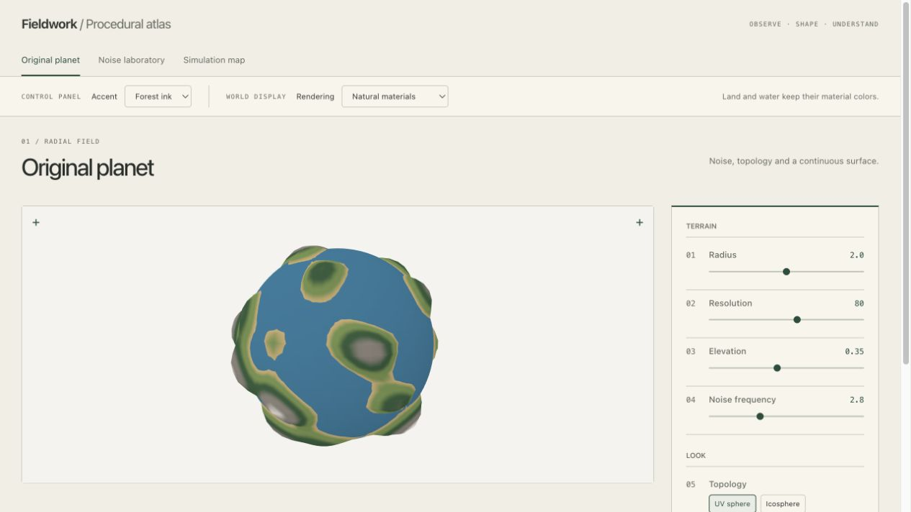

Compare this with the earlier rejected rendering:

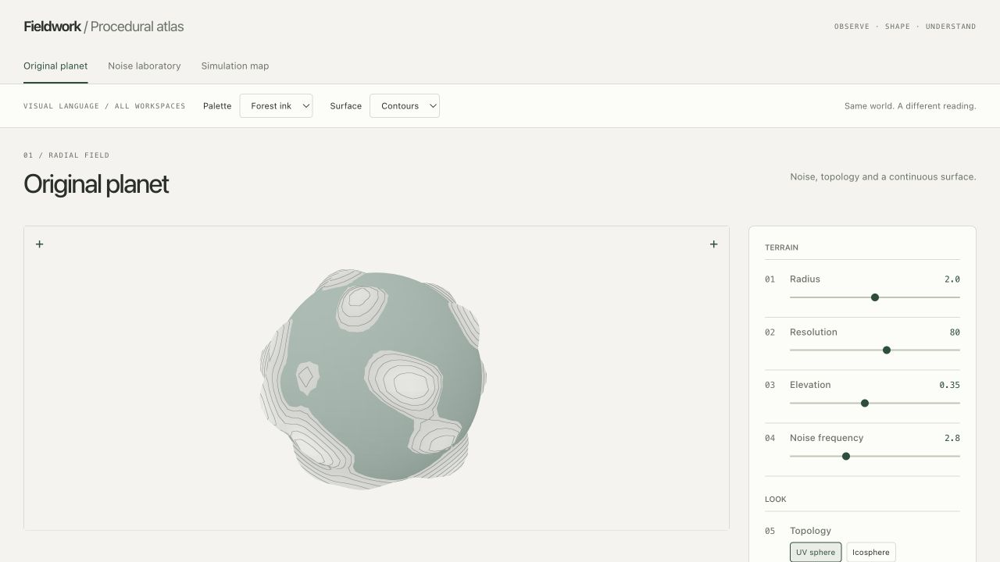

The defaults, frozen spin and camera setup match these two captures; viewport dimensions differ slightly. The change is in material meaning, not a new terrain algorithm.

## 3. Try the two independent control groups

1. Open Original planet and turn Auto spin off for a stable comparison.
2. Under **Control panel**, change **Accent** between Forest ink and Graphite. The buttons and panel accents change. The ocean stays blue and the vegetation stays green.
3. Under **World display**, compare **Illustrated map** (the new default) with **Natural materials**. The later section explains the illustrated treatment.
4. Select **Materials + contours**. The lines are added to the colored terrain rather than replacing it with paper.
5. Select **Materials + stipple**. Dots add shading; they are not voxel samples or water particles.

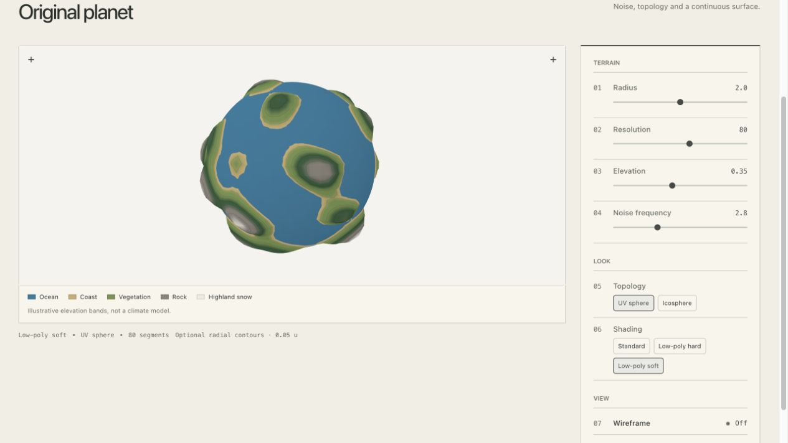

Contour intervals are 0.05 units of radial elevation on Original planet, 0.1 units in Noise laboratory, and 2 units in Simulation map. Close lines can indicate steep ground, although perspective affects apparent spacing.

## 4. Know what each blue region means

**Original planet:** the ocean is a spherical shell. The terrain emerging above it produces the coast.

**Noise laboratory:** this is a height study. Grayscale shows actual source samples and the colored mesh illustrates elevation. There is no water surface or biome simulation, so low ground is not automatically colored blue.

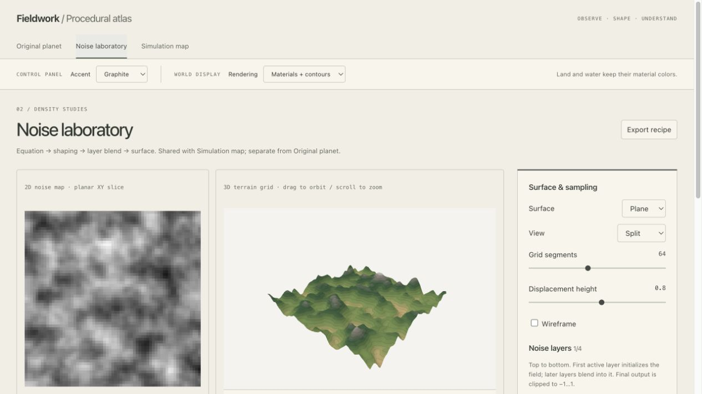

**Explore:** blue fills below the selected sea-level plane. This is a chosen level, not simulated river flow.

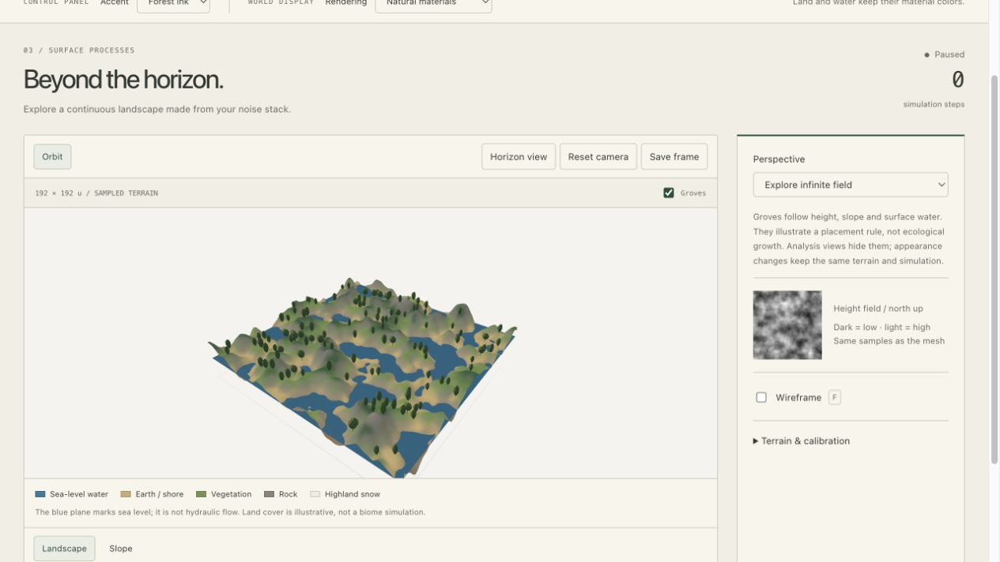

**Hydraulic erosion:** a separate blue surface follows the existing ground + water-depth arrays. Initially there is no water, so dry lowlands remain land. After rainfall, a water surface appears where depth exceeds the display threshold of 0.015 units. Smaller depths remain in the model and remain measurable in Water analysis.

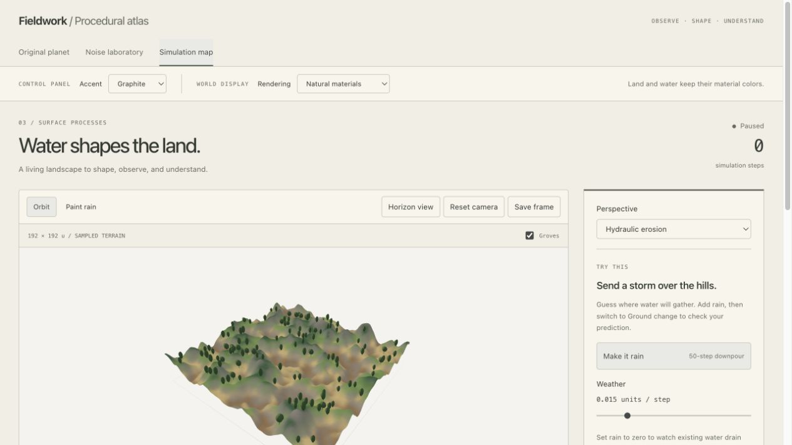

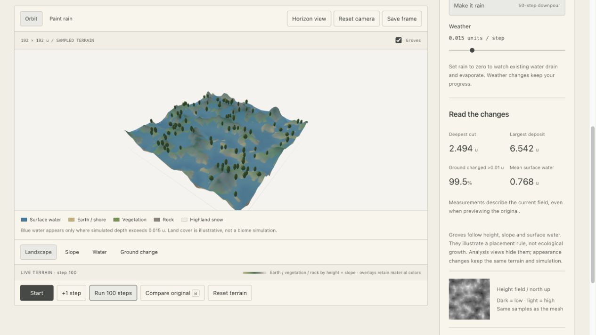

This water layer can coat wet slopes; it is not a flat equilibrium lake or a complete three-dimensional fluid simulation. The solver remains an educational height-field model.

## 5. Keep analysis separate from appearance

Use the buttons below Simulation map when you need measurements:

- **Slope:** 0–60 degrees, pale to forest.
- **Water:** 0–1 u, pale to blue.
- **Ground change:** ochre erosion and teal deposition, saturated at ±0.5 u.

These views hide the grove and water surfaces and use fixed, unlit, unfogged colors. Numerical values can exceed the saturated color range. **Compare original** previews the starting terrain without erasing the current experiment.

## 6. A prompt with clear boundaries

> Refine the control panels using the supplied printed-guide reference: warm paper, aligned labels, thin rules and restrained accents. Keep this separate from world rendering. Preserve blue water, distinct earth, vegetation and rock materials, and explicit legends. Coordinate saturation and light without making the world monochrome. Keep the noise, geometry and simulation data unchanged. Show actual before-and-after screenshots and document the checks in English.

For a future voxel tab, add:

> Reuse the panel system, but give density, solid/empty regions and surface materials their own meaningful representation. A stylish view must still explain what the voxel structure contains.

## Next observation

Without reading the legend, identify one wet area, one patch of exposed ground and one rocky slope. Then read the legend and see whether the interpretation was correct. Record the student's own answer after trying it; visual recognizability is still subject to owner review.

The development check reached step 100 and retained the same four displayed measurements after interface/overlay changes: cut 2.494 u, deposit 6.542 u, changed ground 99.5%, mean water 0.768 u. Leaving Simulation map still resets the workspace; this correction does not add persistence or the planned voxel tab.

## 7. Try an illustrated map, not just a new palette

The next reference was an illustrated Mont-Blanc map. The useful part is its visual vocabulary: pointed trees, white summits, indigo mountain faces and blue waterways. Each category has a shape or mark as well as a color. The controls still follow the printed-guide reference.

**Prompt, translated:** The representations still are not clear enough. Try this hand-drawn comic/cartographic style.

### A short comparison

1. Open **Simulation map** and leave the simulation paused.
2. Choose **Natural materials**. Look at a tree silhouette and one hillside.
3. Choose **Illustrated map** without moving the camera. Trees become stepped conifers; the ground gains narrower color bands, indigo rock faces, pale high areas and local hatching.
4. Compare the screenshots below. Both use the same paused field at step zero and matching camera/viewport framing.

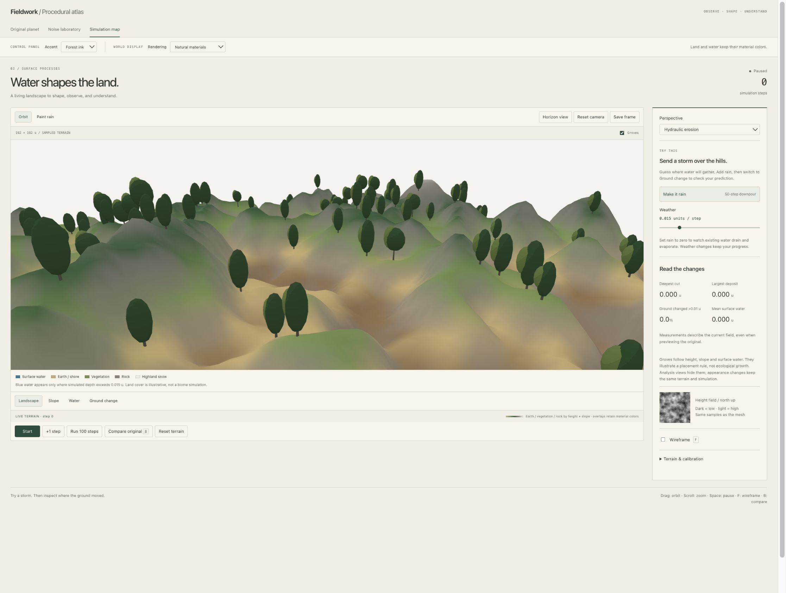

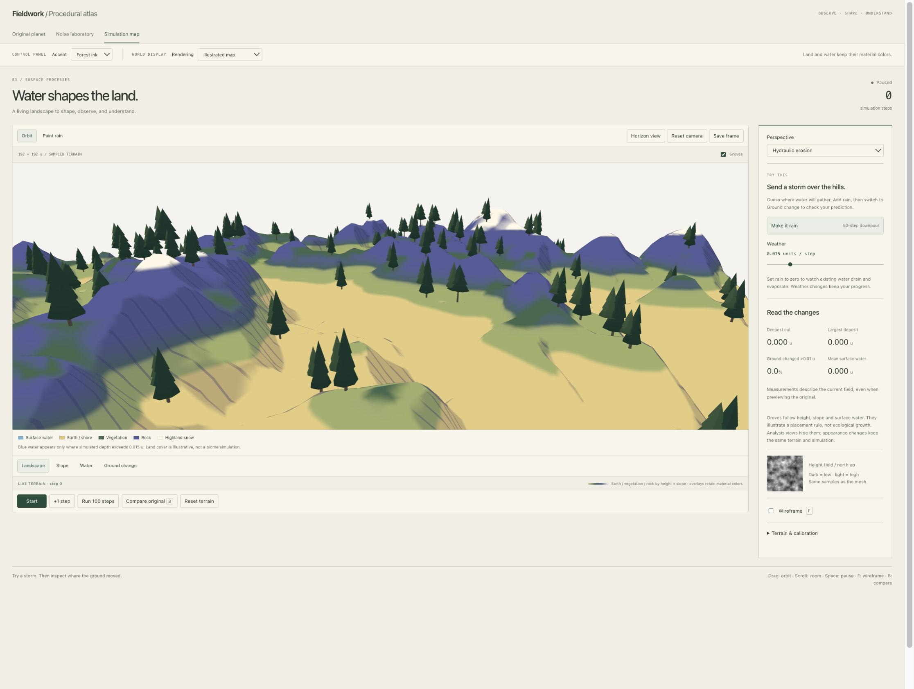

> Side note: the pointed tree outline does more work than another shade of green.

### Read the rules behind the drawing

The shader reads height and surface normals. Height selects narrow material bands. Slope influences exposed rock and reduces the highland snow mask on steep faces. Light direction creates broad shade areas; pen lines darken selected faces. Small coordinate-based variation softens the mechanical edges of the bands. These are rendering rules, not new geological or climate simulations.

Trees still use the existing height, slope and wetness checks. Their positions and instance budget stay the same when their crown geometry changes. The shader does not place trees on every green pixel; green land cover is an illustrative category.

### Water has two different sources

For a coast, select **Perspective → Explore infinite field**. Blue shows the actual sea-level plane where the ground is lower. Changing perspective starts a different field session, so save an experiment before switching.

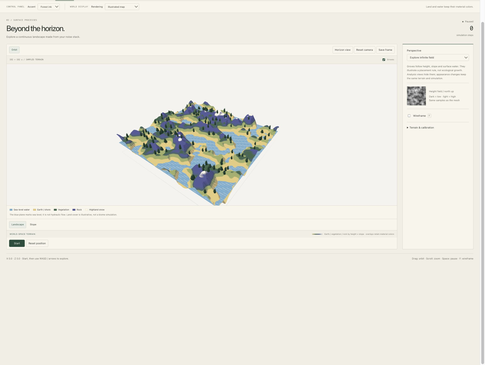

For erosion, use **Hydraulic erosion → Run 100 steps**. Blue follows the simulated water-depth field. The pale strokes are static drawing marks; they do not show current direction or velocity. Rain can leave a blue film over slopes because this is an educational height-field solver.

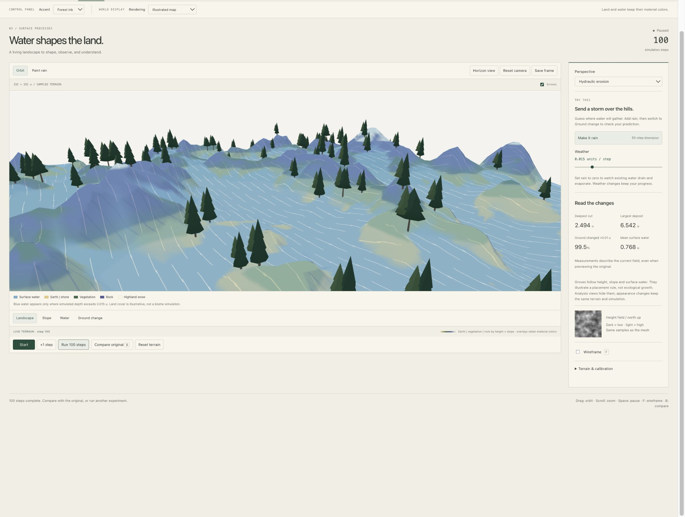

Switch to **Water** analysis for numerical interpretation. The marks, trees and decorative water surface disappear, leaving the fixed depth scale.

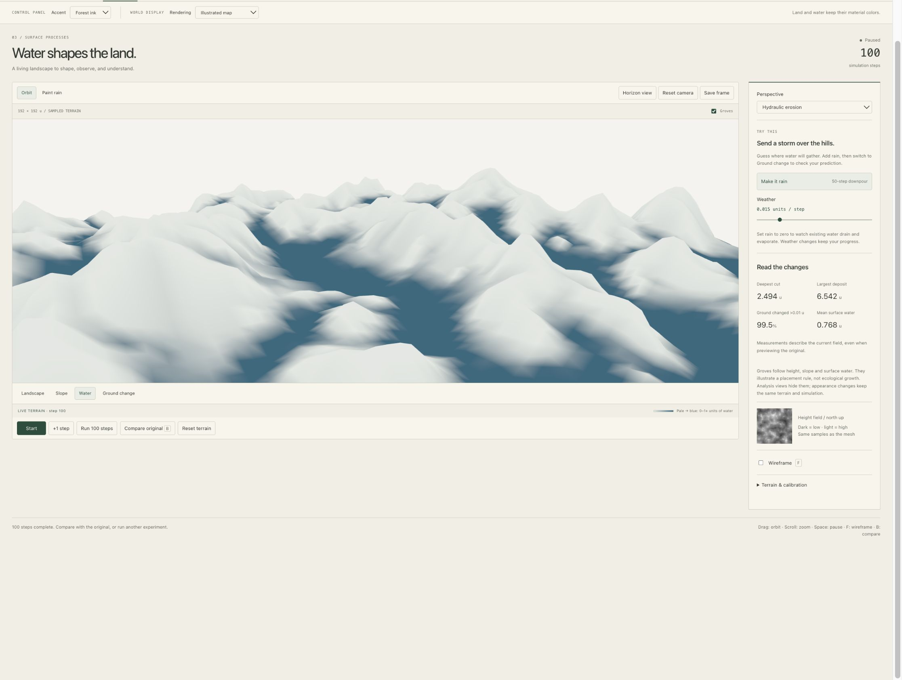

> Side note: a blue brushstroke can say “water.” It cannot tell us how fast that water is moving.

### The other workspaces

Original planet uses the same palette and pen treatment on its radial surface; its ocean remains a separate shell. Noise laboratory uses the same drawing style on its height study and never invents water from a low noise value.

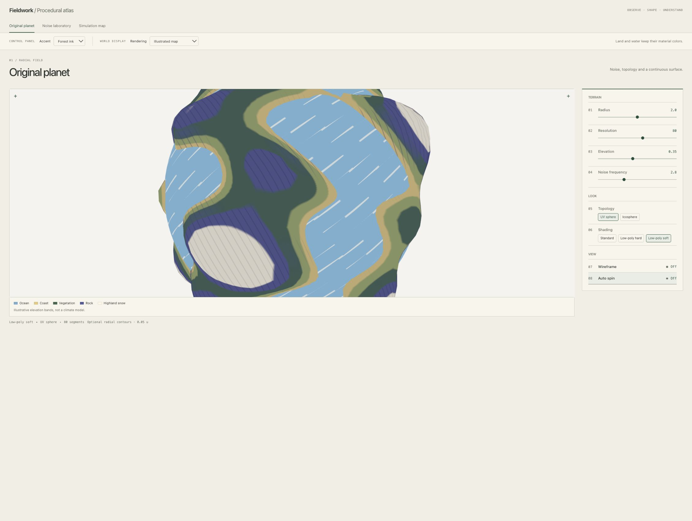

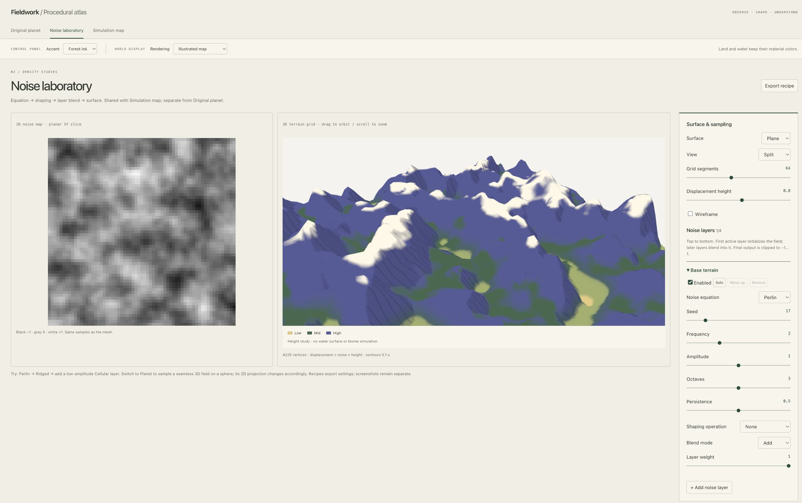

This is a procedural approximation of an illustration. It does not reproduce the reference artist's hand lettering, drawn landmarks or composed Alpine skyline. The next useful review is whether the blue water and indigo rock remain easy to separate when the terrain is small on screen.
