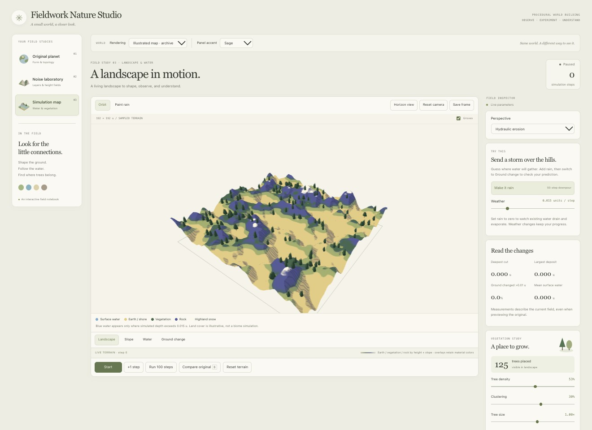

# 08 — Nature Studio, Shadows and Tree Distribution

## The question behind this experiment

Can a simple illustrated world still communicate terrain, water, vegetation and procedural detail? This iteration tests that question while giving the controls a clearer study / viewport / inspector structure.

**User request, paraphrased in English:** Begin the redesign using the agreed world illustrations and control-panel references. Keep the world readable and support meaningful tree distribution detail.

## 1. Separate the instrument from the world

The controls borrow the organization of the supplied cell-study UI: choose a study on the left, inspect the object in the center, adjust it on the right. Soft sage, warm paper, serif headings and rounded cards connect the interface to the landscape without turning water or rocks into interface colors.

Each tab uses the same shell. The current workspaces are still Original planet, Noise laboratory and Simulation map. There is no voxel tab yet.

> Side note: the interface should help explain the picture. It should not decide that everything in the picture needs to be green.

## 2. Read volume through light

Choose **Natural illustration** in World rendering. Height and slope control earth, green cover, exposed rock and pale high terrain. The new palette is less saturated than the earlier indigo-and-ochre illustration.

In Simulation map, a directional light produces an actual shadow map. Tree meshes cast shadows onto the terrain, and the terrain shader samples that map. Distance fog is now explicitly integrated into this custom shader. These effects do not displace vertices or advance the hydraulic solver.

Compare with **Illustrated map · archive** without moving the camera. Keep the same seed, resolution, paused step and grove settings. Switching interface accent should only change controls.

> Side note: a tree's shadow tells us where it touches the world. Extra leaf polygons cannot replace that cue.

## 3. Give water its own rules

In Explore mode, the sea remains a level plane. A small texture made from the terrain heights lets its shader estimate depth below that plane. Shallow water is lighter, deeper water darker, and the edge receives a restrained pale treatment. A view-angle highlight gives a reflective impression, but it does not reflect buildings, trees, or the scene.

The ripple lines are static. They do not measure current direction. Hydraulic erosion still uses a separate water-depth surface driven by its existing solver; this redesign does not add a new fluid model.

## 4. Study tree distribution

The vegetation card reports the actual placed count. Its three controls have different meanings:

- **Tree density:** acceptance probability for a fixed set of deterministic candidates. Zero removes all trees. Higher values accept more candidates, up to the fixed capacity.
- **Clustering:** increases spatial differences in acceptance probability. Some areas become fuller and others emptier. Total count can change; this is not a constant-count relocation tool.
- **Tree size:** scales the existing tree instances without changing their anchor positions or count.

Height, slope and surface water still exclude unsuitable candidates. Changing these controls updates tree meshes without resetting erosion or modifying the ground and water arrays. Tree placement is re-evaluated as terrain and water change; disappearance is a suitability rule, not a simulated death event.

Try this sequence:

1. Pause the simulation and record its step and measurements.
2. Set Tree density to zero. The placed count should become zero.
3. Restore density to 53%. With the same field and clustering, the count and placements should reproduce.
4. Change Tree size. The count should remain the same.
5. Switch to Water or Slope. Trees are hidden to preserve the analytical view, and the card says they are hidden.

**Population dynamics remains future work:** growth, age, competition, reproduction and mortality need explicit state and time rules. Do not describe the current distribution controls as an ecosystem simulation.

## 5. Ask AI for a controlled change

An example prompt for the next iteration:

> Keep the same terrain samples, hydraulic state, camera and diagnostic scales. Add one adjustable visual effect to Natural illustration and retain the current look as a comparison. Explain which world data it reads, which pixels it changes, and whether it affects the simulation. Save matched screenshots and record the result in English.

Add one effect at a time so its contribution can be explained. Current limitations include a 650-tree capacity, shadows limited to the bounded Simulation map, static wave marks, and no saved simulation across workspace changes. See the dated log for the checks actually performed.
