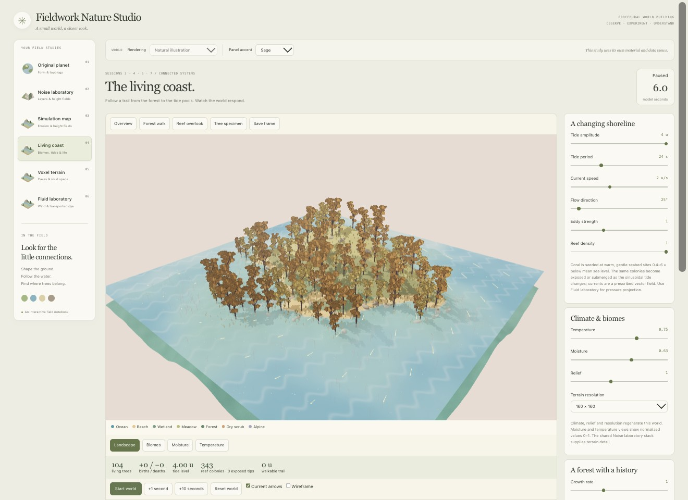
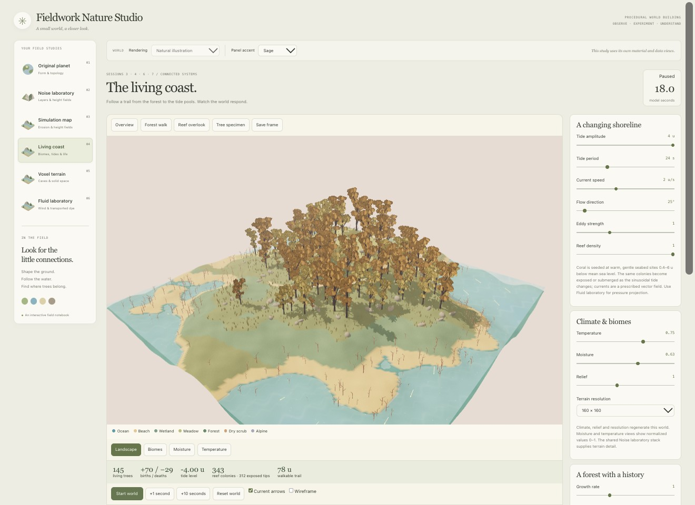
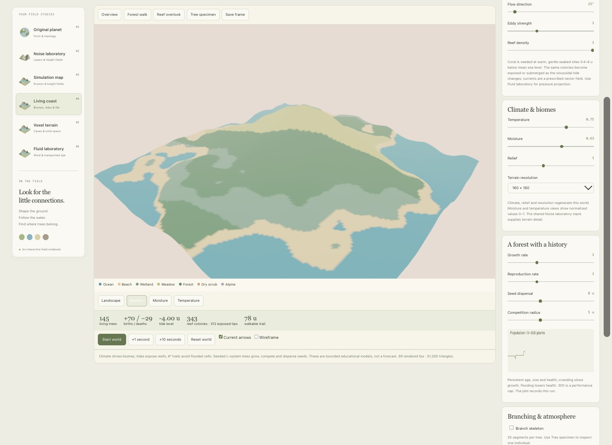
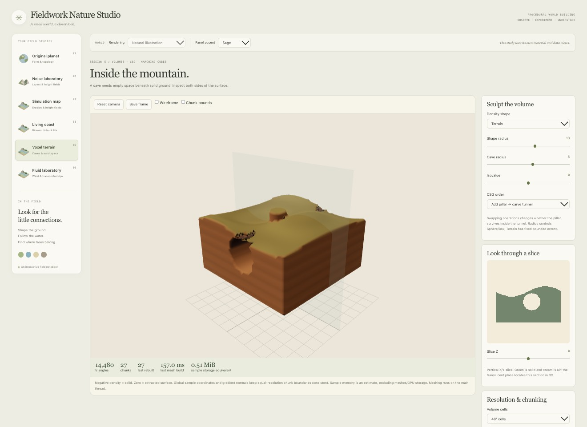
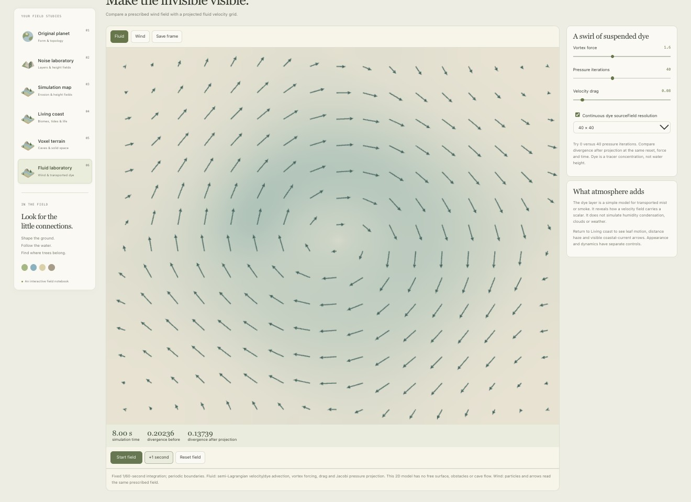

# 12 — Connected Worlds: Coast, Caves and Living Forests

Date: 2026-10-07 · Sessions 3–7 · Implementation and experiment notebook

**Request, translated and condensed:** Make paths, reefs, biomes, tides and currents demonstrable; implement the missing course concepts; improve the world with detailed branching, foliage and shaders inspired by the supplied woodland game references.

This release adds three working studies: **Living coast**, **Voxel terrain** and **Fluid laboratory**. The original planet, Noise laboratory and erosion study remain available. These are bounded educational models, not a complete Earth simulator. The course mapping follows the supplied session topics; this is not a transcript of the missed lectures.

## Start here: a five-minute tour

1. Open **Living coast → Forest walk**. Drag to orbit. Compare leaf silhouettes, branches, grass and shadows with the earlier geometric groves.
2. Choose **Overview**. Press **Start world**, then **Pause**. Time changes the sea level, currents and plant state. **+1 second** and **+10 seconds** advance fixed steps while paused.
3. Switch **Landscape → Biomes → Moisture → Temperature**. These views explain the rules behind the picture. Return to Landscape for materials and foliage.
4. Open **Voxel terrain**. Change **CSG order** and move **Slice Z**. Then **Carve local pocket** and enable **Chunk bounds**.
5. Open **Fluid laboratory**. Advance eight seconds in Fluid mode, then compare Wind mode. Fluid solves an approximate pressure projection; Wind follows a prescribed velocity field.

In Living coast, focus the canvas and press **F** for wireframe or **Space** to pause. Hidden studies pause automatically. Switching tabs retains mounted study state; reloading the page does not save the simulation. Each study has its own clock and representation.

## Session 3 — Detail comes from several layers

The coast uses the shared Noise laboratory stack for height detail, a smooth terrain mesh, procedural grain and strata, shadowed lighting and distance haze. Water uses seabed depth for color and transparency, shoreline foam and animated surface marks. Tree crowns use crossed leaf cards with an alpha-cutout texture; branches are actual geometry. Grass and rocks add small-scale cues.

The interface stays warm paper and sage. The world keeps readable blue/teal water, sand, vegetation and rock. Diagnostic maps use their own legends and unlit materials so changing illumination does not change what a value means.

| Parameter | Range / default | Experiment |
| --- | --- | --- |
| Terrain resolution | 96, 160, 224 cells per side / 160 | Hold the noise stack fixed; compare silhouettes, wireframe and rendering cost. |
| Relief | 0.3–2 / 1 | Compare steepness, tree suitability and the path. |
| Autumn palette | 0–1 / 0.7 | Change foliage color without advancing age or the tide. |
| Atmospheric haze | 0–0.02 / 0.003 | Compare depth readability; haze is an appearance effect. |
| Wind strength | 0–4 / 1.5 | Observe leaf motion while time runs; this does not solve branch mechanics. |

> Side note: increasing polygon count alone would miss the point of the references. Branch silhouettes, small foliage shapes and overlapping shadows do much of the work.

## Session 4 — Biomes, tides, reefs and a walkable path

Climate values are normalized 0–1, not degrees Celsius or measured rainfall. Temperature falls with elevation; moisture and temperature also vary spatially. Height, slope and climate classify Ocean, Beach, Wetland, Meadow, Forest, Dry scrub and Alpine regions. Some classes may be absent with a particular setting. The Biomes legend explains the colors.

**Temperature** defaults to 0.75 and **Moisture** to 0.63. Change one, inspect the map, then compare the population after reset. A biome is a classification rule, not simply a green material. This simplified classification responds immediately; it does not model decades of biome succession.

Reef candidates are accepted on warm, gentle seabed sites 0.4–6 world units below mean sea level. **Reef density** selects a reproducible subset. The same colonies stay anchored as the tide changes. There is no coral growth or bleaching solver.

A* finds a route between two fixed landmarks on a 41 × 41 height grid. Water cells are impassable and **Trail slope penalty** makes climbing more expensive. The trail follows terrain; it does not avoid tree trunks or provide character navigation. It is recomputed after a substantial sea-level change or a path-cost adjustment.

### Actual experiment: high tide versus low tide

Default shared noise stack and coast settings, except **Tide amplitude = 4**, **Tide period = 24 seconds**. Start at zero, advance six seconds, then twelve more. Camera and viewport stay fixed. The clock also advances plant growth, so this is a coupled-system experiment, not an isolated tide-only trial.

| Time | Sea level | Reef colonies | Exposed tips indicator | Walkable trail | Living trees |
| --- | --- | --- | --- | --- | --- |
| 0 s | 0 u | 343 | 31 | 78 u | 104 |
| 6 s | +4 u | 343 | 0 | 0 u: flooded endpoint | 104 |
| 18 s | −4 u | 343 | 312 | 78 u | 145 |

The exposed-tip indicator uses a fixed 1.2-unit reference height above each colony's anchor; it is a teaching approximation, not a geometric water-intersection measurement. At 18 seconds the counters reported 70 births and 29 deaths: 104 + 70 − 29 = 145.

> Side note: a path disappearing at high tide explains more than another decorative line on the map. The route now depends on the world state.

The existing **Simulation map** still contains the hydraulic erosion model. Its terrain/water/sediment arrays do not feed this new coast. This release connects climate, tides, trails and plants inside Living coast; it does not silently combine incompatible solvers.

## Session 5 — A cave is a volume, not a surface effect

Voxel terrain evaluates a scalar density in a 48-unit-wide cube. Negative means solid, positive means air and zero is the extracted surface. Try Terrain, Sphere, Box, Ridged and Noise volume. The last one varies with all three coordinates. This volume currently uses its own density functions rather than the shared 2D noise stack.

With negative-inside fields, union is `min(A,B)`, intersection is `max(A,B)` and subtraction is `max(A,-B)`. **Add pillar → carve tunnel** removes the pillar where the tunnel passes. **Carve tunnel → add pillar** restores a pillar through that space. Intersection clips the result with a sphere.

| Control | What to try | What it reveals |
| --- | --- | --- |
| Shape radius | 6–18, default 13 | Sphere/Box/Noise volume size, or intersection boundary. Terrain itself has fixed bounds. |
| Cave radius | 0–9, default 5 | Zero disables the tunnel; increasing it removes more solid. |
| Isovalue | −2 to 2, default 0 | Moving the surface threshold changes the extracted shape. |
| Slice Z | −24 to 24 | A vertical X/Y section: green solid, cream air. |
| Volume cells | 32³, 48³, 64³ | Higher sampling cost and finer surfaces. |
| Chunk cells | 8³ or 16³ | Smaller update regions, but more chunks and boundaries. |

Actual **Marching Cubes** interpolates the zero surface. Shared global sample positions and density-gradient normals keep equal-resolution chunk boundaries consistent. The renderer corrects triangle winding toward the outward gradient, including cavity walls.

**Observed:** at 48³ cells and 16³ chunks, the default cave had 14,480 triangles across 27 chunks. Carving the local pocket rebuilt 8 of 27 chunks and produced 14,588 triangles. One browser capture measured 157.0 ms for a full build and 62.9 ms for the local edit. These are single observations, not a hardware-independent benchmark. The 0.51 MiB readout estimates sample storage only; meshes, JavaScript objects and GPU resources add more.

Marching Cubes is implemented. Greedy cube meshing, Surface Nets and Dual Contouring remain comparison topics, not additional working modes. Meshing still runs on the main thread; worker jobs and mixed-resolution LOD remain future work.

> Side note: chunking is useful even for a small cave. A local edit should not require rebuilding distant rock.

## Session 6 — An animated texture is not a fluid solver

Living coast currents are a **prescribed horizontal vector field**. Current speed, direction and eddy strength change arrows and particle trajectories. Setting speed to zero stops transport. Water surface marks are stylized visual cues, not quantitative flow measurements.

Fluid laboratory provides a separate **2D grid simulation**: semi-Lagrangian velocity and dye advection, vortex forcing, velocity drag, a Jacobi pressure solve and projection. Integration uses 1/60-second steps with periodic boundaries. Dye represents tracer concentration, not water height.

| Fluid control | Range / default | Purpose |
| --- | --- | --- |
| Vortex force | 0–4 / 1.6 | Add rotational motion. |
| Pressure iterations | 0–100 / 40 | Reduce divergence more accurately at greater cost. |
| Velocity drag | 0–1 / 0.08 | Damp velocity; this is not a viscosity parameter. |
| Field resolution | 24, 40, 64 per side / 40 | Change spatial detail and CPU cost. |
| Continuous dye source | On by default | Keep injecting tracer; switch off to follow existing dye. |

**Observed:** after eight seconds at the defaults, RMS divergence was 0.20236 before projection and 0.13739 afterward. Projection reduced divergence, but did not eliminate it. This collocated, finite-iteration solver is approximate.

Next controlled trial: reset, run eight seconds with 0 iterations, record both divergence readouts; reset and repeat with 40. That comparison is a suggested experiment, not an already captured result.

In **Wind** mode, arrows and particles share the prescribed field. Speed spans 0–12 u/s, direction 0–360°, swirl −3 to 3. Zero swirl gives a constant field. There is no pressure solve in Wind mode. Mist transport is a useful analogy for dye, but clouds, condensation, free-surface waves and 3D cave water are not simulated.

## Session 7 — Branching, growth and population are different systems

The branching grammar is `F → F[+F]F[-F][&F]`. Rewriting happens in parallel. A 3D turtle turns the string into branches; bracket pairs save and restore turtle state. One, two and three iterations create 5, 25 and 125 branch segments per tree. Branch angle ranges from 15° to 50°.

Use **Tree specimen** and **Branch skeleton** to inspect one tree. Changing grammar regenerates the world; it is different from a tree aging during a run. Each plant stores identity, age, size, health and a simple species category. Existing branch geometry scales with growth; it does not sprout new grammar modules over time.

- **Initial tree density** controls starting acceptance, not birth rate.
- **Growth rate** changes individual size gain; crowding and poor health slow it.
- **Reproduction rate** changes seed production by mature, healthy plants.
- **Seed dispersal** changes the candidate distance from a parent.
- **Competition radius** controls which neighbors affect growth.
- Flooding and unsuitable habitat reduce health; old or unhealthy individuals die.

The population plot records the current run. The hard limit of 300 plants is a performance cap, not ecological carrying capacity. Time is deliberately accelerated model time, not a claim that forests grow in seconds. Repeating the same settings and seed reproduces the same stepped experiment.

## Reset behavior and limits

Appearance, tide/current, growth and path-cost controls change the current run. Climate, shared noise layers, terrain resolution/relief, initial tree density and grammar regenerate the coast. Reset world restarts at the current settings. Changing Fluid resolution or mode resets that field. Voxel local-pocket edits retain unaffected chunks; global shape changes rebuild them.

The new studies are lazy-loaded and retained after their first visit. This avoids losing a run just by switching tabs, but uses memory for each visited scene. There is no saved-session persistence yet. The coast is finite, the voxel domain is bounded, and the fluid domain wraps. None is an infinite streaming world.

Build, lint and 13 simulation/geometry/ecology tests passed during implementation. Browser checks covered the tide sequence, biome view, local chunk rebuild, fluid stepping and Wind mode. The existing large base-bundle warning remains. Screenshots are real app captures; the earlier and new forest views use different worlds and cameras, so they are not a controlled shader A/B comparison.

## Source trail

- [World, climate, ecology and path rules](../../app/src/worldSystems.ts)
- [Tree geometry and nature materials](../../app/src/natureRendering.ts)
- [Voxel density and meshing](../../app/src/voxelEngine.ts)
- [Fluid integration and projection](../../app/src/fluidEngine.ts)
- [Three.js MarchingCubes documentation](https://threejs.org/docs/pages/MarchingCubes.html)
- [NVIDIA GPU Gems: Fast Fluid Dynamics Simulation on the GPU](https://developer.nvidia.com/gpugems/gpugems/part-vi-beyond-triangles/chapter-38-fast-fluid-dynamics-simulation-gpu)
- [The Algorithmic Beauty of Plants](https://algorithmicbotany.org/papers/abop/abop.pdf)

Read the focused foundations in [Session 5](09%20-%20Session%205%20-%20Voxels%20and%20Spatial%20Density.md), [Session 6](10%20-%20Session%206%20-%20Vector%20Fields,%20Fluids%20and%20Atmosphere.md) and [Session 7](11%20-%20Session%207%20-%20L-systems,%20Growth%20and%20Ecosystems.md). Their original plans are preserved; the implementation updates identify what now exists.
