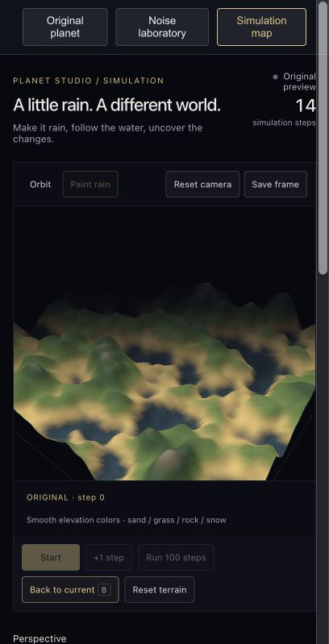
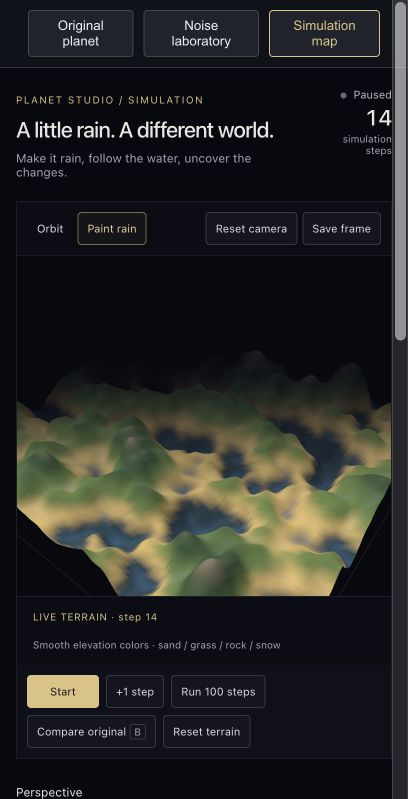
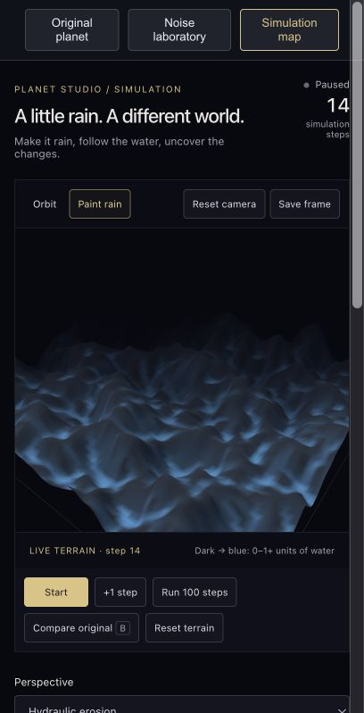
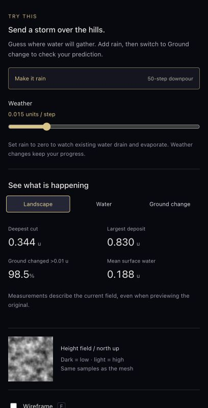

# September 9 — From noise to a terrain playground

Today's direction: make the terrain respond to experiments, with enough visual feedback to understand what changed. This log records the prompts, implemented behavior, and actual app captures. The questions below came from our conversation; the numerical observations were read from the app.

## 1. Give the noise stack somewhere to go

**Prompt, shortened:** “Add simulation map section … create a height field … driven by my noise stack … keyboard to navigate … toggle on/off wireframe.”

The app now has three workspaces: the original planet, Noise laboratory, and Simulation map. Noise laboratory combines seeded Perlin, Cellular, and Sine layers, with shaping and blending. Simulation map samples that same stack to produce terrain. Solo selection carries across too.

The original planet still uses its earlier sine terrain and stylized shader. The new shared stack currently drives the laboratory and simulation map.

**Small note:** Noise is the starting shape. It does not explain how that shape changes over time.

## 2. Let water change the ground

**Prompt:** “For example the hydraulic erosion simulations as a new perspective.”

The simulation adds rain, moves water downhill, removes ground, carries sediment, deposits it, and evaporates water. Start/Pause and +1 step make the process inspectable. Explore mode is a separate way to travel through a generated field; erosion stays inside one fixed window.

**Question asked:** “所以这个simulation是实时的吗 根据时间有什么变化” — Is this simulation real-time, and what changes over time?

It updates interactively while running. Each simulation step updates water, sediment, and ground height. Pausing stops those updates. A step is a numerical iteration, not a day or a year, and this model has no real-world time calibration. Changing the display view does not advance time.

**Small note:** A moving camera is not evidence that the ground is evolving. The step counter and ground-change view are more useful checks.

## 3. Make the surface easier to read

**Question asked:** “为什么感觉有点太lowpoly了 是本该就是这样吗” — Why does it look so low-poly? Is it supposed to?

The simulation terrain now uses smooth lighting and blended elevation colors. Geometry resolution still controls how much shape detail the mesh can represent. Smooth lighting can soften visible triangles, but it cannot create missing valleys. The original planet keeps its chosen low-poly style.

At 96 × 96 segments, the simulation has 18,432 triangles across a 192-unit square: samples are 2 units apart. Increasing noise frequency without enough samples can make detail look rough or misleading. Compare resolution and noise scale together.

**Small note:** More triangles and better terrain are two different things. First check which noise details the grid can actually represent.

## 4. Make an experiment out of it

**Prompt:** “Make it more playful and interesting.”

- **Paint rain:** click the terrain to add a local pulse of water.
- **Make it rain:** trigger a 50-step downpour on top of the current weather. Normal simulation continues afterward until paused.
- **Run 100 steps:** advance 100 additional steps and pause automatically.
- **Compare original / B:** preview the starting ground without deleting the current result.
- **Water:** inspect accumulated water depth.
- **Ground change:** inspect where erosion and deposition occurred.
- **F:** toggle wireframe. **Space:** start or pause when focus is outside form controls.

**Small note:** Predict where water will collect before pressing Start. Then use the alternate views to check the prediction.

## 5. Saved progress — the same experiment, several views

These are actual screenshots captured on September 9 in the narrow in-app browser. The app was already paused at **step 14**. No simulation steps were added and the terrain was not reset during capture. The camera was reset to a consistent angle for the four scene images. These are views of one experiment, not four separate runs or a reconstruction of earlier UI versions.

### Starting ground, retained for comparison

The original preview displays the starting ground. The header still says 14 because the current experiment remains stored at step 14; it has not been reset. Use Back to current to return to it.

### Current landscape — step 14

The familiar elevation colors make the land easy to read, but small changes are hard to judge from this view alone. Green and snow-colored bands are based on height, not a simulated climate.

### Where the water is

Blue represents water depth, on a scale from 0 to 1+ world units. This is a diagnostic coloring of the terrain, not a separate animated water surface.

### Where the ground moved

Orange marks removal and teal marks deposition. Colors saturate at ±0.5 units. A strong color can indicate a small height change; it is not proof of a dramatic canyon.

### Controls and measurements

Recorded values: deepest cut **0.344 u**, largest deposit **0.830 u**, ground changed by more than 0.01 u **98.5%**, mean surface water **0.188 u**. Rainfall is **0.015 units per step**. These describe the same retained field; the controls screenshot happens to have Landscape selected.

The changed-area percentage uses a small threshold. A high percentage does not mean the terrain has been dramatically reshaped.

## Try next — not yet recorded as a personal observation

1. Stay with one terrain and camera angle. Capture the original.
2. Choose Paint rain and add water to a hill. Predict its path.
3. Use +1 step a few times, then Run 100 steps.
4. Capture Landscape, Water, and Ground change. Note the step count and settings.
5. Write one sentence: “I expected ___; the water actually ___.”

Changing resolution, relief, or the noise stack resets the experiment. Leaving the simulation workspace also resets its progress. Weather changes preserve it.

## Checks and remaining work

Build, lint, and four simulation tests pass. The tests cover localized rainfall, finite/nonnegative state and approximate terrain-plus-sediment conservation over 300 steps, evaporation, and difference metrics. Earlier development checks exercised batch stepping, original comparison, weather changes, wireframe, and a storm with dry background weather; those checks are separate from the step-14 screenshot record.

Save frame requests a labeled PNG download, but file delivery through the in-app browser has not been verified. The five images above were saved through actual browser screenshot capture, so the notes do not depend on that export button.

The hydraulic model uses a simplified grid with closed edges and can show grid-direction artifacts. Next work includes preserving simulations across sessions, checking export delivery, and improving flow distribution. Hand tracking remains an idea.

Continue with [tutorial 04](04%20-%20Simulation%20Map%20and%20Hydraulic%20Erosion.md) or the [feature backlog](../planning/backlog.md).
