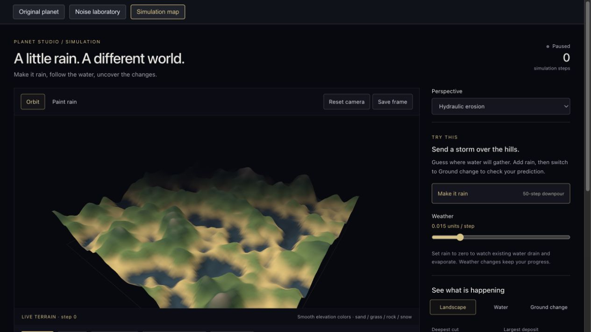
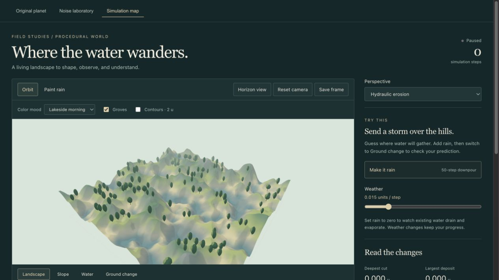
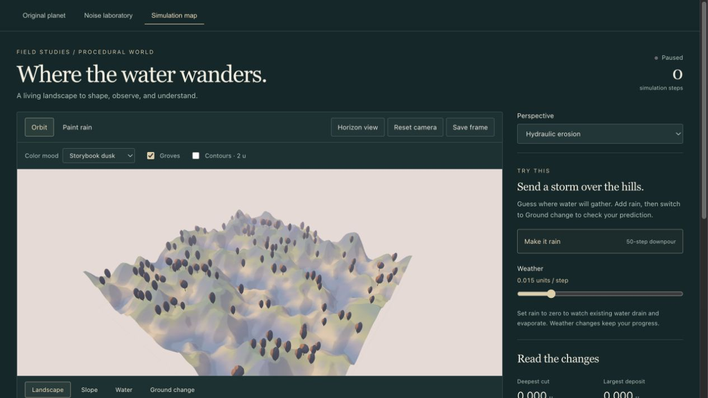
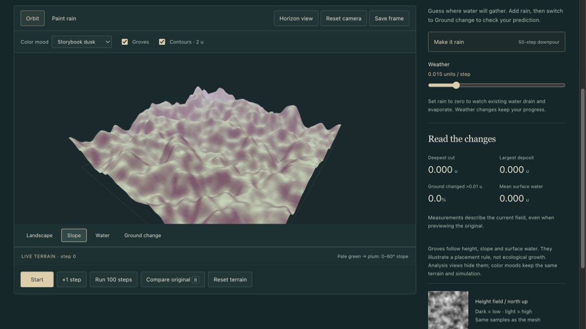
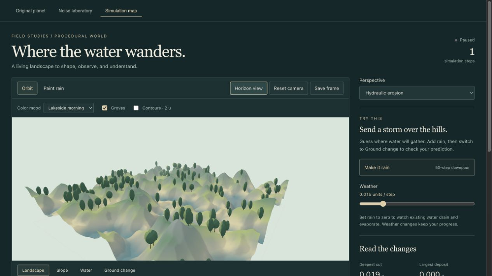
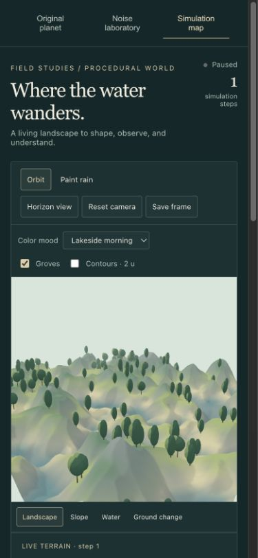

# September 10 — An illustrated landscape with inspectable rules

## Request

**User request, translated into English:** “I want to change the style, referencing Lake and Nomada Studio's journey game, while retaining the detailed procedural world building requirements and achieving the stylized look I want.”

The Nomada reference was interpreted provisionally as **Neva**. The interpretation and implementation are a first preview, not an owner-approved final direction.

## Reference to implementation

[Lake's official page](https://gamious.com/portfolio/lake/) provides the lakeside setting reference. [Neva's official imagery](https://nomada.studio/) provides a reference for plant silhouettes, large color regions, and atmospheric depth. The implementation uses original code-generated materials and geometry; no game artwork is shipped in the app.

The first pass adds two art palettes, broad shader lighting bands, subtle distance haze, procedural groves, and a lower camera view. A deep evergreen frame and small serif headings support the scene. Slope and contour views provide additional ways to inspect the terrain beneath the styling.

> Small note: The interesting balance is a landscape that feels calm, with rules that can still be explained when the decoration is hidden.

## 1. Before

Captured before editing: default stack, seed 17, frequency 2, three octaves, height 22, resolution 96, sea level -4, erosion paused at step 0, default camera. This is a new development preview; the app server was not running at the start of this session.

## 2. Lakeside morning

The same starting height field and camera now have a pale sky, sage land, evergreen groves, and a quieter frame. The toolbar and canvas layout changed, so this is not a pixel-aligned comparison. Mesh resolution and noise settings are unchanged.

## 3. Storybook dusk

The palette moves toward blush, lavender, and plum while retaining the same step-0 ground and tree positions. This is a color mood, not simulated dusk or a season.

## 4. Expose the height structure

Contours follow the mesh every 2 height units. The terrain can remain softly shaded while its slopes and ridges become easier to read.

## 5. Expose the slope

Slope is calculated from neighboring height samples. Pale green represents shallow slopes and plum reaches full color at 60 degrees. Groves disappear in this view so they do not cover the measurement. The page is scrolled to include the legend and controls.

## 6. Lower the camera

This is a composition check after a single development test step. The lower camera emphasizes overlapping land and tree silhouettes. It is intentionally not the same camera as the preceding comparison images.

## 7. Check a narrow screen

At a requested 390-pixel viewport, controls wrap above the scene, and the document has no horizontal overflow. The browser viewport override was removed afterward. The image shows the same one-step test field from Horizon view.

## 8. Explore the shoreline

A separate fresh preview uses Explore mode at the starting coordinates, with Horizon view and Lakeside morning. Its water plane intersects the terrain at sea level. It is a visual shoreline, not a hydraulic result or evidence of erosion-generated lakes.

## What was checked

- Production build and lint pass; Vite reports the existing large-bundle warning.
- All six tests pass: the four hydraulic tests, planar slope correctness including boundaries, and deterministic/non-mutating grove placement with slope and water exclusions.
- The two moods, contours, Slope, Water, Ground change, Horizon view, and F wireframe were exercised in the browser.
- A single erosion step produced cut 0.019 u, deposit 0.000 u, changed area 6.9%, and mean water 0.015 u. Switching mood and diagnostic views preserved those displayed values and the step count.
- A temporary development refresh error was fixed before final capture. The fresh Explore preview reports no browser errors.
- Eight actual screenshots are saved beside this note; they are not generated mockups.

## Remaining questions

This is an illustrated terrain study, not yet a complete game environment. The next visual improvements should address a deliberate basin/ridge composition, more varied vegetation silhouettes, and coherent distant layers. The grove rule is deliberately simple and can change abruptly at thresholds. It is not an ecological model.

The shared noise sampler and hydraulic solver were not changed. There is no new geological calibration, persistence, or seasonal simulation. Existing export-delivery verification remains open. The original planet retains its earlier shader; this pass concentrates on Simulation map and the surrounding interface.

**Suggested personal observation, not yet answered:** Which mood feels closer to the intended world, and which terrain feature is easier to understand with contours turned on?

Continue with [tutorial 05](05%20-%20Stylized%20Landscapes%20and%20Procedural%20Detail.md), the [style guide](../../STYLE-GUIDE.md), or the [backlog](../planning/backlog.md).
