# September 17 — One visual language across the app

> **Later owner feedback:** the monochrome world rendering in Experiment 1 was rejected because it obscured material meaning. Experiment 2 below records the correction; its controls supersede the first version.

# Experiment 1 — Initial shared-palette preview

## Request

**Translated and lightly edited:** “Try a more refined, minimal direction using these references. Keep the design consistent across every tab. Adjust the procedural world's palette and shaders so the image stays ordered and coherent while its phenomena remain visible.”

## What changed

- Added a shared warm-paper interface with forest or graphite ink, fine rules, restrained headings, and matching right-hand controls on desktop.
- Added global Palette and Surface controls. Original planet, Noise laboratory and Simulation map now share Relief, Contours and Stipple rendering.
- Replaced the original planet's space background and decorative stars with a pale globe study. The sine terrain and topology controls remain; the shared shader now offers smooth normals, flat normals, or harder lighting through the existing Shading choices.
- Kept the noise map grayscale and tied to the mesh's samples. Noise recipes now include appearance settings.
- Recolored the simulation terrain, groves and Explore water. Kept the same noise sampler, erosion solver and grove-placement rules.
- Added small color scales to analysis captions. Water, slope and ground-change colors remain fixed, unlit and free of atmospheric fog.
- Updated the style guide and the English tutorial in the shared Obsidian directory.

The three references were supplied as screenshots. Their visual principles informed the implementation; their artwork, logos and data markers were not added to the app.

## Before and after

These are real browser captures from the local app. Baselines were saved before this change in a separate preview tab, without manipulating the user's existing tab. The field parameters match the defaults; simulation before/after images show step zero. The new layout changes viewport proportions, and the planet and terrain cameras were pulled back to frame the objects. These are design comparisons, not pixel-aligned geometry comparisons.

### Original planet

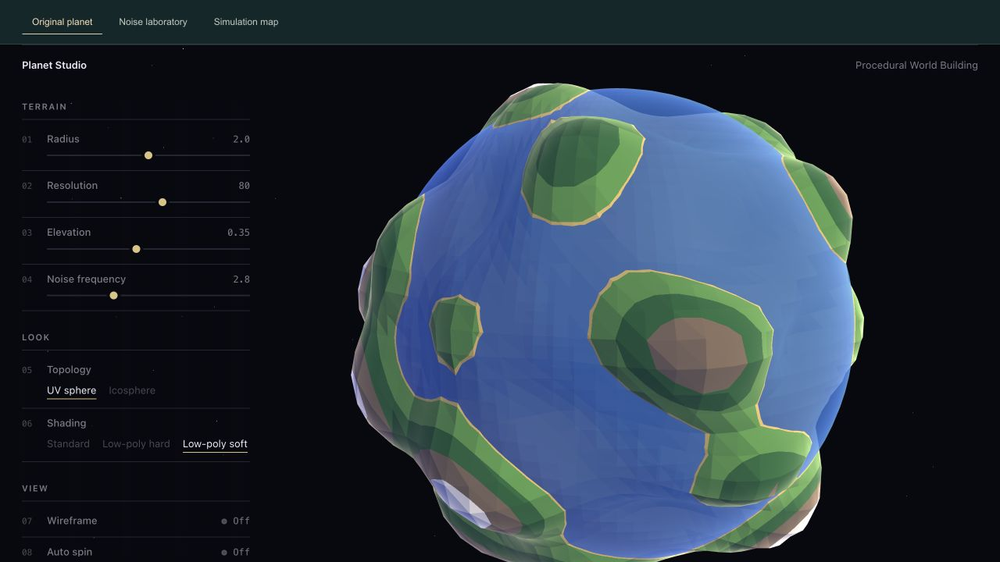

Radius 2, resolution 80, elevation 0.35, frequency 2.8, UV sphere, Low-poly soft, spin off. The reference-inspired restraint now applies to both the interface and the world.

### Noise laboratory

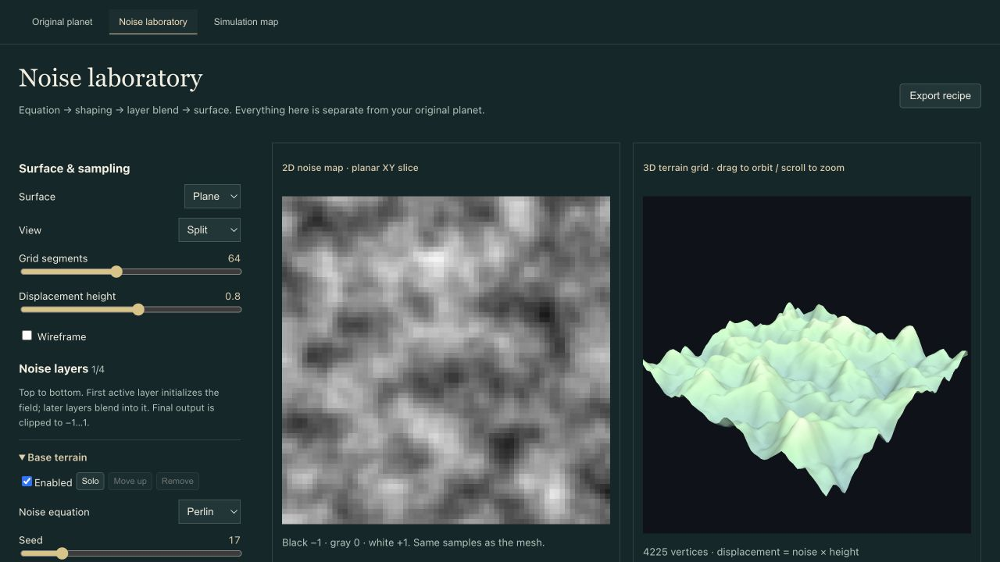

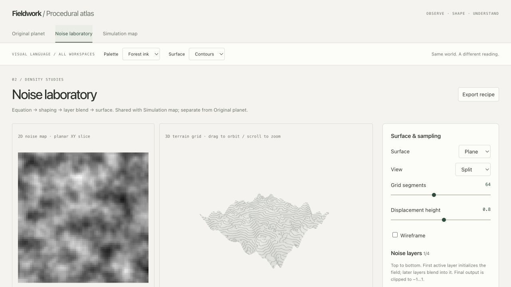

Plane, Split, 64 segments, height 0.8, one default Base terrain layer. The left preview still shows actual grayscale noise samples.

### Simulation map

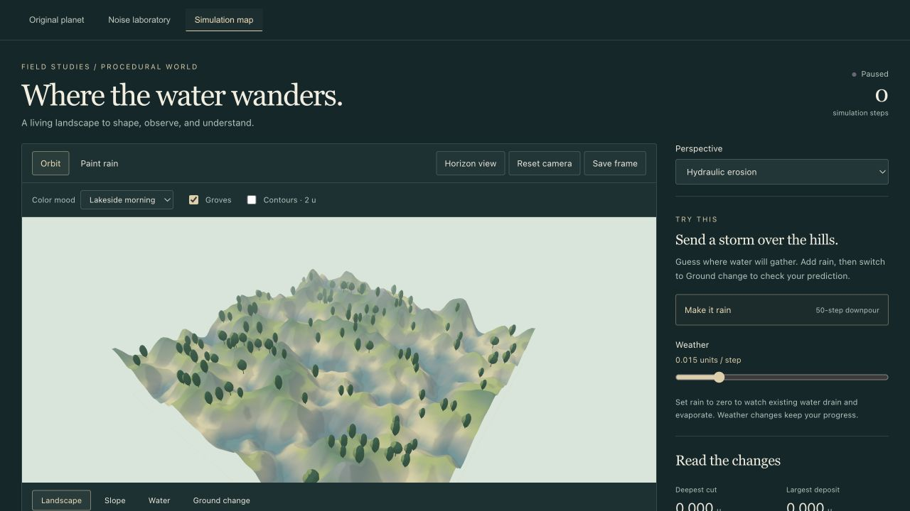

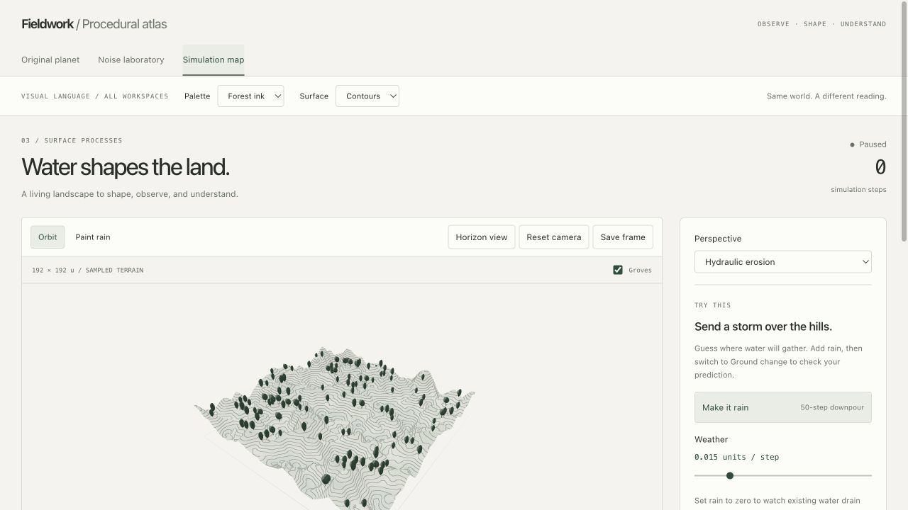

96 segments, relief 22, default noise, groves enabled, paused at step zero. The long control panel continues below the initial viewport.

> Side note: the contour view makes the construction of the landscape visible. The trees can remain simple because the terrain already carries information.

## Additional trials

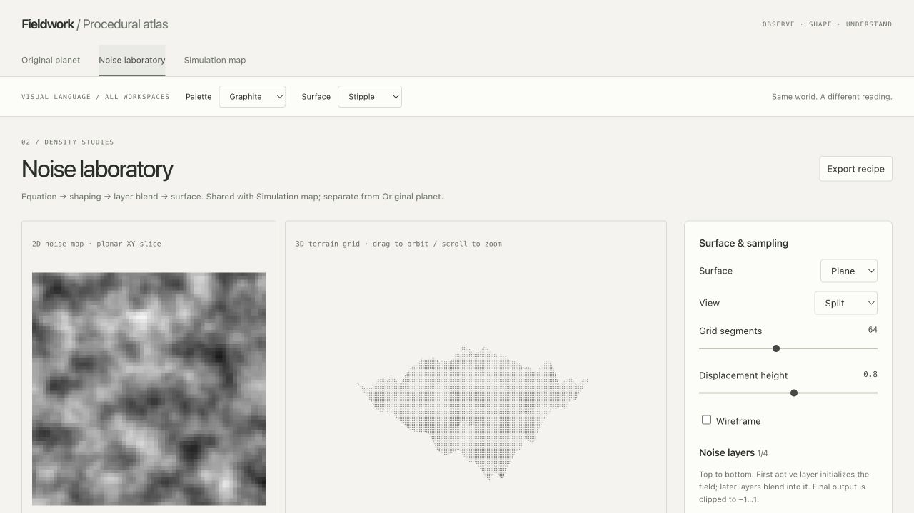

Stipple is a graphic lighting treatment. It does not add geometric detail or represent samples in a volume.

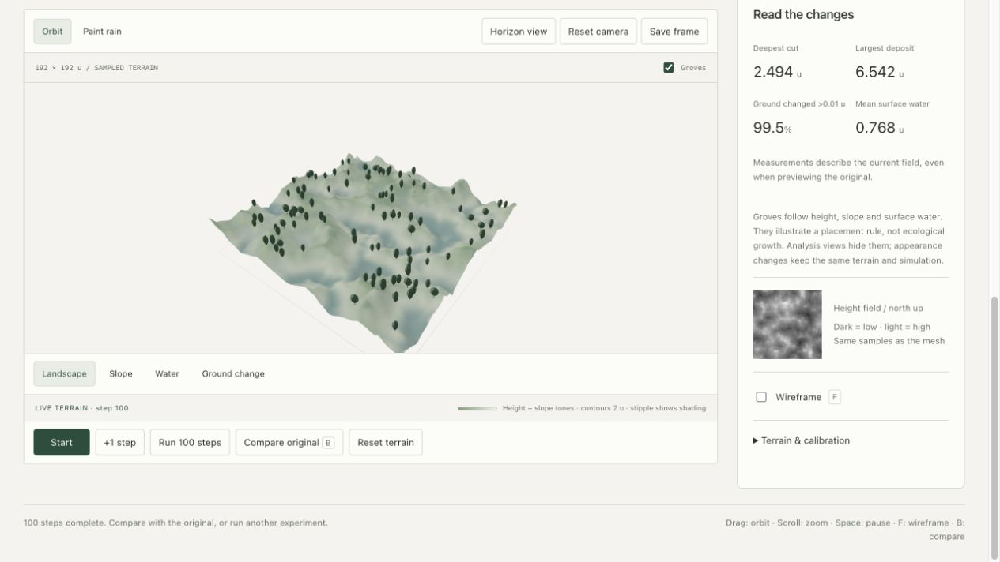

Relief removes contour lines while preserving the same simulated field and grove-placement rules.

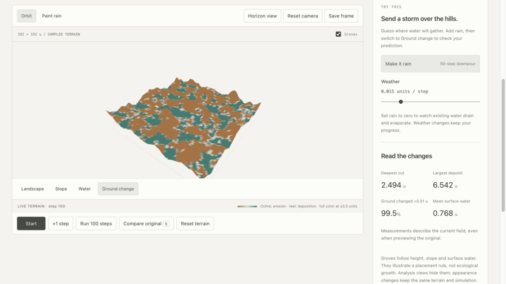

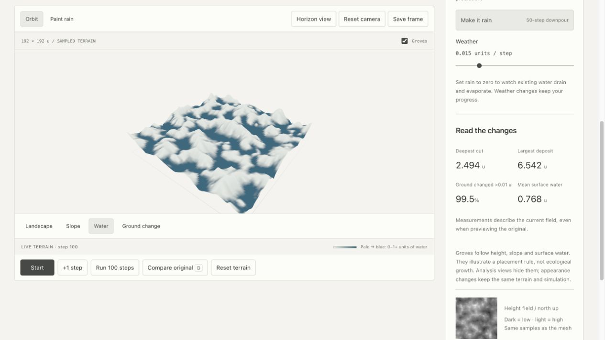

The palettes above represent data. Ground-change colors saturate at ±0.5 u, while the numerical measurements can exceed that range.

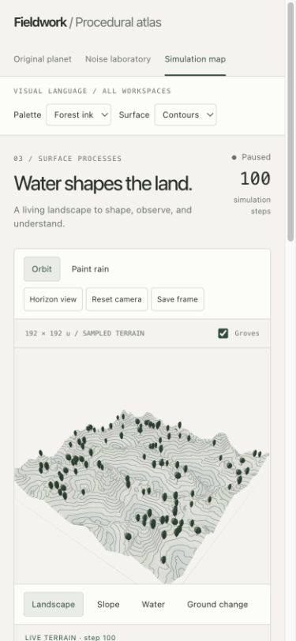

At the 390-pixel browser test size, controls wrap and the settings panel follows the terrain. The scrollbar leaves a 375-pixel content width.

## Verification

- Production build and lint passed. Vite still reports the existing large-bundle warning; this pass does not implement code splitting.
- All six simulation and landscape regression tests passed: localized rainfall, terrain/sediment exchange, drying, change metrics, slope calculation, and deterministic grove placement without field mutation.
- Inspected all three workspaces in the browser, including Contours, Relief and Stipple, plus the two global palettes.
- Ran the default erosion model to 100 steps with automatic pause. Switching Forest ink / Contours to Graphite / Stipple preserved step 100 and all four displayed measurements: deepest cut 2.494 u, largest deposit 6.542 u, changed ground 99.5%, mean water 0.768 u.
- Original comparison showed step-zero terrain and disabled advancing that preview; returning restored the current display. The wireframe checkbox remained operable.
- Tested narrow layouts. A planet-canvas minimum-width issue was found and corrected during this check.
- Removed atmospheric fog from analysis colors after the visual check showed it weakened the legend's meaning.
- Saved and inspected the screenshots above. Notes live in the Obsidian vault's Tutorials link to the repository, keeping one canonical copy.

## Limits and next experiment

This is a local style preview awaiting review, not a deployment or push. PNG download delivery is still an open verification item. The shared shader changes appearance; it does not add voxel terrain, geological calibration, or persistent simulation storage. Leaving Simulation map still resets its state. Stipple uses screen-space dots and may shimmer while the camera moves.

**Next experiment:** hold the noise seed fixed and compare which of Relief, Contours and Stipple best explains one ridge and one valley. Add the student's own observation after trying it.

Read [[07 - A Consistent Visual Language for Procedural Worlds]] for the guided steps and reusable prompts.

# Experiment 2 — Separate the instrument panel from the world

## Owner feedback and reference analysis

**Translated and condensed:** “I cannot tell what is water, mountain or land anymore. Analyze the style first, and discuss the world display and controls separately: they have different purposes and boundaries. The reference is for the control panel. The world must retain its geographical representation, and only then coordinate its colors with the site.”

The new reference is a printed Grand Canyon shuttle guide. The panel borrows cream information columns, compact hierarchy, rules and restrained emphasis. It does not borrow the faded reproduction quality or force the landscape into a monochrome map.

**Decision:** meaning and recognizability take priority over palette uniformity. The first world-rendering direction was rejected; the quiet interface direction remains useful.

## Implementation

- Split Interface accent from World rendering. Accent state affects CSS only and is not supplied to world materials.
- Default to Natural materials. Blue water, warm soil/coast, green vegetation, mineral rock and pale highland material are distinct again.
- Keep contours and stipple as optional overlays on top of those colors.
- Add explicit material legends and label illustrative land-cover rules honestly.
- Keep Noise laboratory a height study: low samples do not fabricate water.
- Add a separate surface reading the existing hydraulic water depth. It uses ground + depth for height and hides depths below 0.015 u visually; the model retains all water. This improves visibility without changing the solver.
- Keep the Explore sea-level plane separate from hydraulic water; exclude both from diagnostic views.
- Update the style guide's control-panel and world-display boundaries, and rewrite tutorial 07 around the correction.

## Evidence

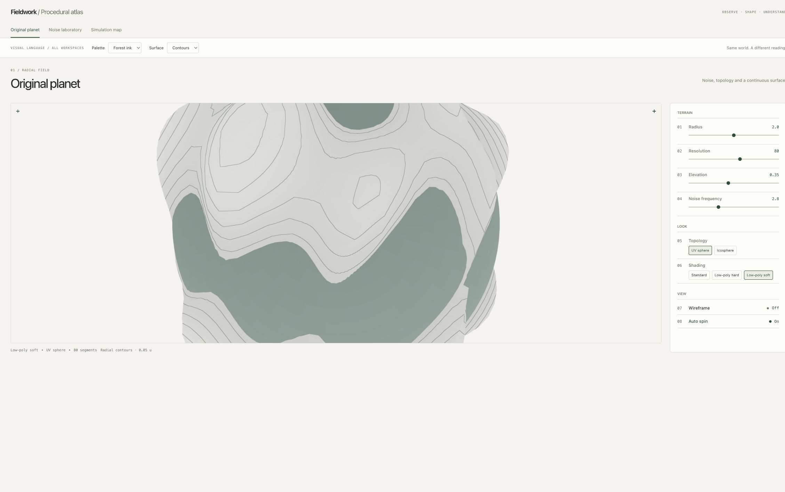

This capture preserves the observed zoomed, spinning planet state. It is not camera-matched to the new default-view screenshot. For a closer default-view comparison, use image 04 from Experiment 1 against image 13 below; both use frozen spin and the same default camera setup, with slightly different viewport dimensions.

> Side note: blue has a job now. It should tell the reader there is water, not simply that a point is low.

## Checks and limits

- Build and lint passed; all six existing simulation/landscape regression tests passed.
- Inspected planet, noise and simulation views with the corrected colors; browser checks reported no shader errors.
- Ran the default erosion trial to step 100: cut 2.494 u, deposit 6.542 u, changed ground 99.5%, mean water 0.768 u. These match the earlier solver result.
- Switching Interface accent and the material overlay preserved those measurements and step count.
- Checked the revised toolbar at a 390-pixel browser size across all three workspaces; content width matched viewport width (375 pixels after the scrollbar), with no horizontal overflow.
- Checked Water analysis and original/current comparison; explored the separately labeled sea-level plane.
- The water surface is a depth visualization of a height-field solver. It may coat wet slopes and is not a fully physical fluid mesh, equilibrium lake or cave-water system.
- Saturation and lighting are coordinated with the interface, but land materials are still illustrative rules rather than a climate or biome simulation.

**Next owner review:** can water, exposed ground, vegetation and rock be identified without first reading the legend? Revise the scene if this fails, while keeping the panel's own typography and interaction criteria separate.

This remains a local preview; no commit or push was made for this correction.

---

# Experiment 3 — Illustrated material cues

## Request and reference

**User prompt, translated:** The representations still are not clear enough. Try this hand-drawn comic/cartographic style.

The supplied Mont-Blanc poster separates pale snow, indigo mountain faces, forest-green shapes, recognizable conifers, ochre ground and blue waterways. This reference applies to the world display. The existing warm-paper control panel remains the interface reference.

## What changed

- Added **Illustrated map** as the default rendering option across all three workspaces. Natural materials, colored contours and stipple remain available.
- Added narrow, slightly irregular elevation bands, slope-aware rock/snow masks, broad directional shade, local hatching and a fine view-dependent ink rim.
- Replaced round crowns with stepped conifers in illustrated mode while preserving tree placements and the 650-instance capacity.
- Added blue water with short, static pen marks. Explore uses sea level; erosion uses actual water depth. The marks are anchored to field coordinates and do not encode flow velocity.
- Updated material legend swatches independently from interface accent colors.
- Kept height samples, geometry, noise recipes, solver logic and diagnostic palettes unchanged.

## Captures

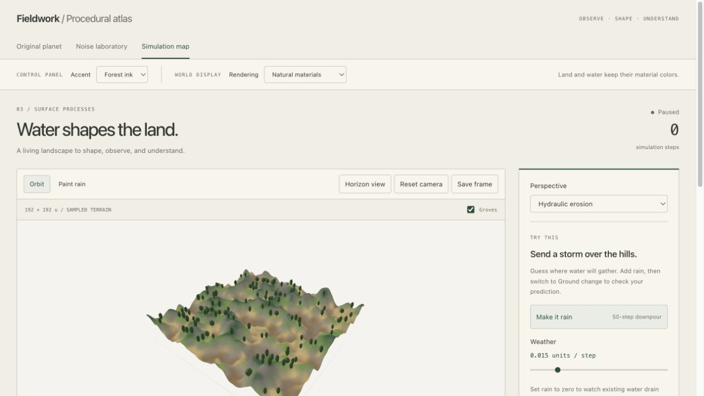

The initial capture is at a smaller viewport and a distant camera. The following pair was captured afterward by switching only the rendering option on the same paused, step-zero field. These two images share the same viewport and camera, making the material comparison more useful.

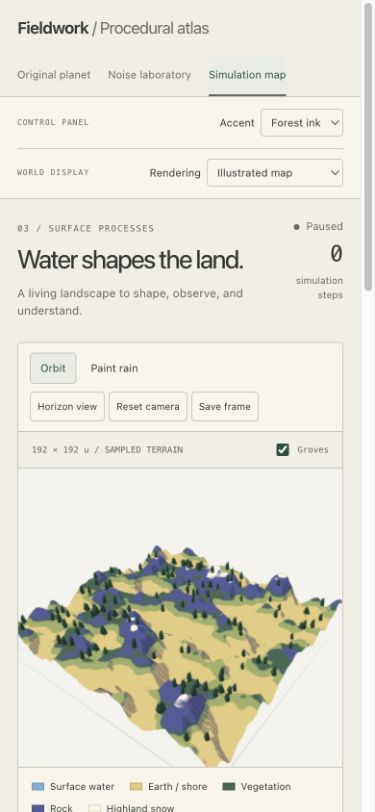

> Side note: a limited palette works better when each material also gets its own shape or mark.

## Actual checks

- Production build and lint passed. All six simulation/landscape tests passed, including the updated check that conifer styling preserves deterministic placement and field arrays.
- Inspected the three workspaces in the browser; no shader errors were reported.
- The default 100-step erosion trial again produced a deepest cut of 2.494 u, largest deposit of 6.542 u, changed ground of 99.5%, and mean water depth of 0.768 u.
- Switching Natural materials → Illustrated map at step 100 preserved the measurements and paused state.
- Inspected Water analysis and Explore's separate sea-level surface.
- Checked Noise laboratory and Simulation map at a 390-pixel browser width: content and viewport widths both measured 375 pixels after the scrollbar. Restored the normal viewport after capture.
- Verified saved image encodings as JPEG and kept the notes in the shared Obsidian Tutorials folder. The attempt to open the tutorial through the Obsidian URI failed because macOS could not find a compatible executable; the shared files and image links were verified, but in-app Obsidian rendering was not checked.

## Limits and next experiment

The new rendering is a procedural approximation, not a hand-painted scene. Snow and vegetation are illustrative masks, not climate/ecology outputs. The hydraulic water film can cover slopes; static water marks do not represent currents. Leaving Simulation map or changing perspective still resets that field session. The existing production bundle-size warning remains.

**Next owner experiment:** at a small viewport, identify water, forest and rock before reading the legend. If indigo rock competes with blue water, tune their value contrast or reduce hatch density. Record the owner's observations after the trial; this preview is not yet approved.

No commit or push was made for this iteration.
