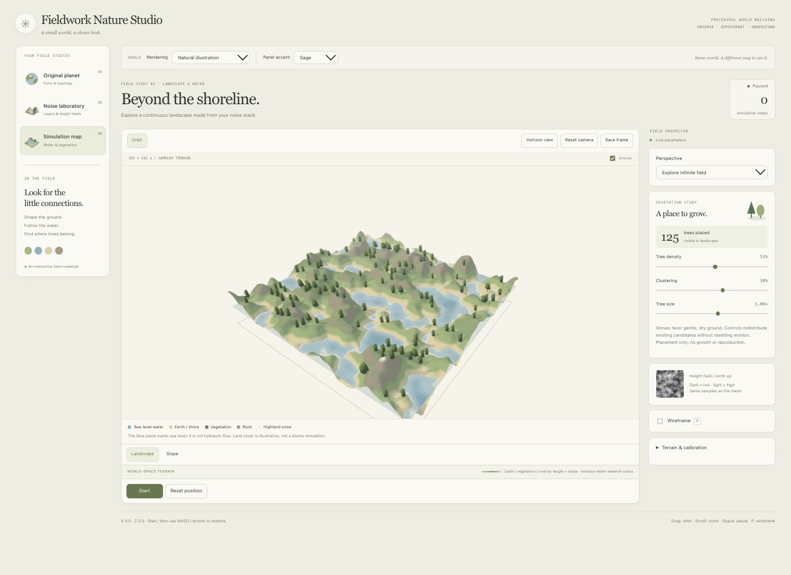
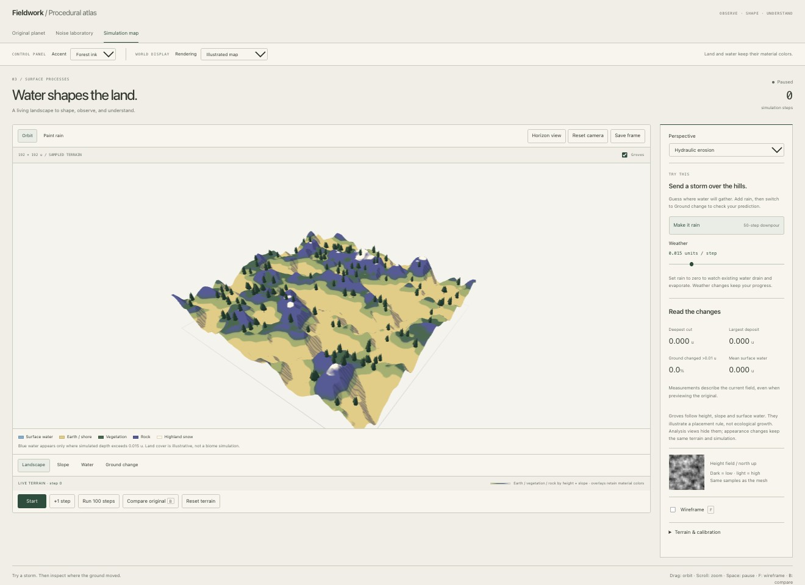
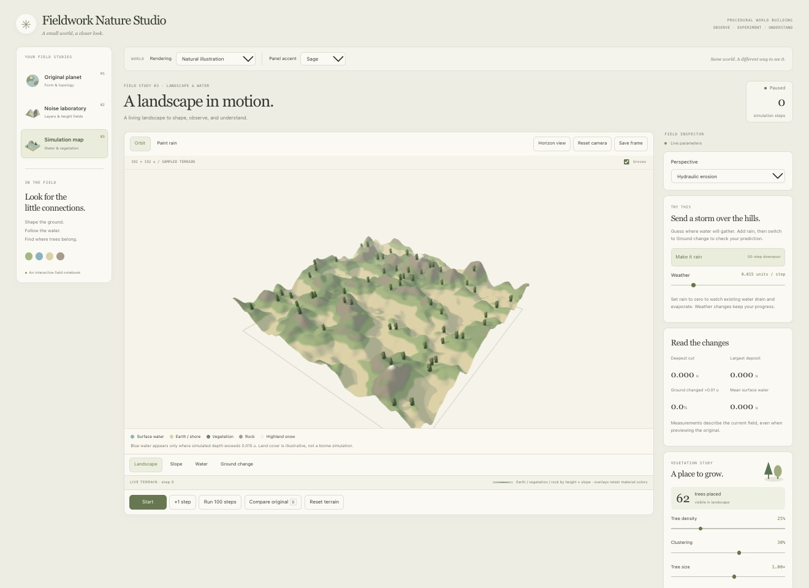
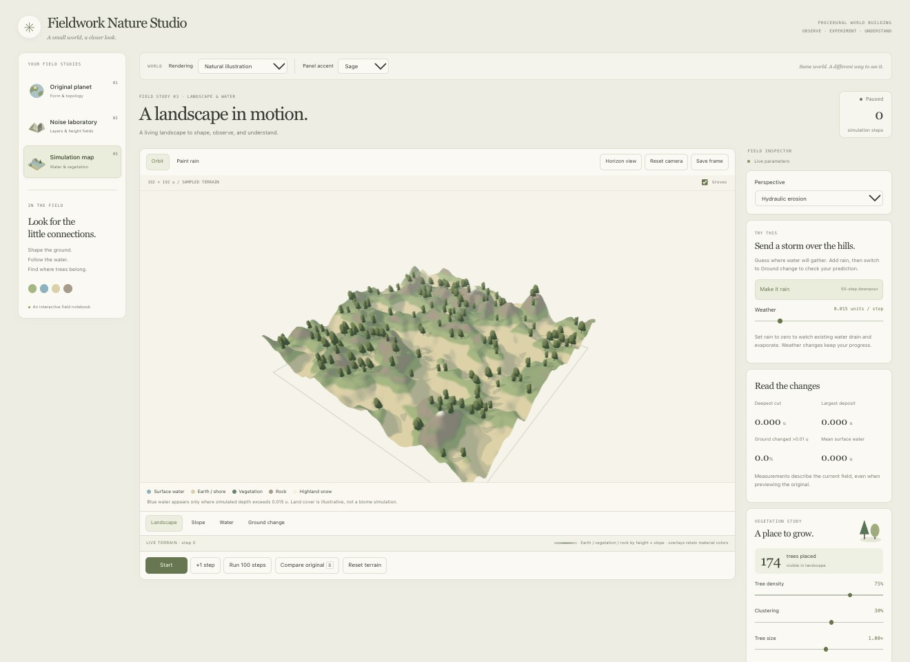
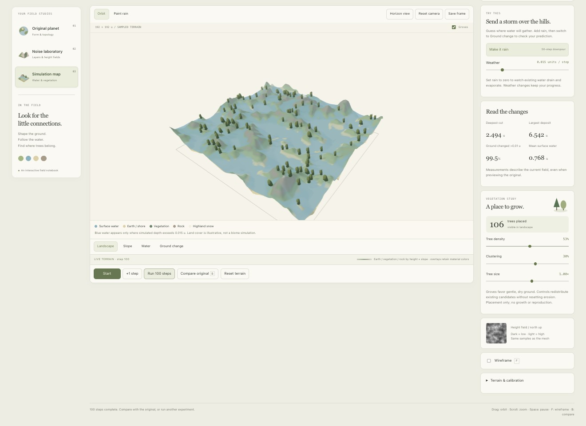
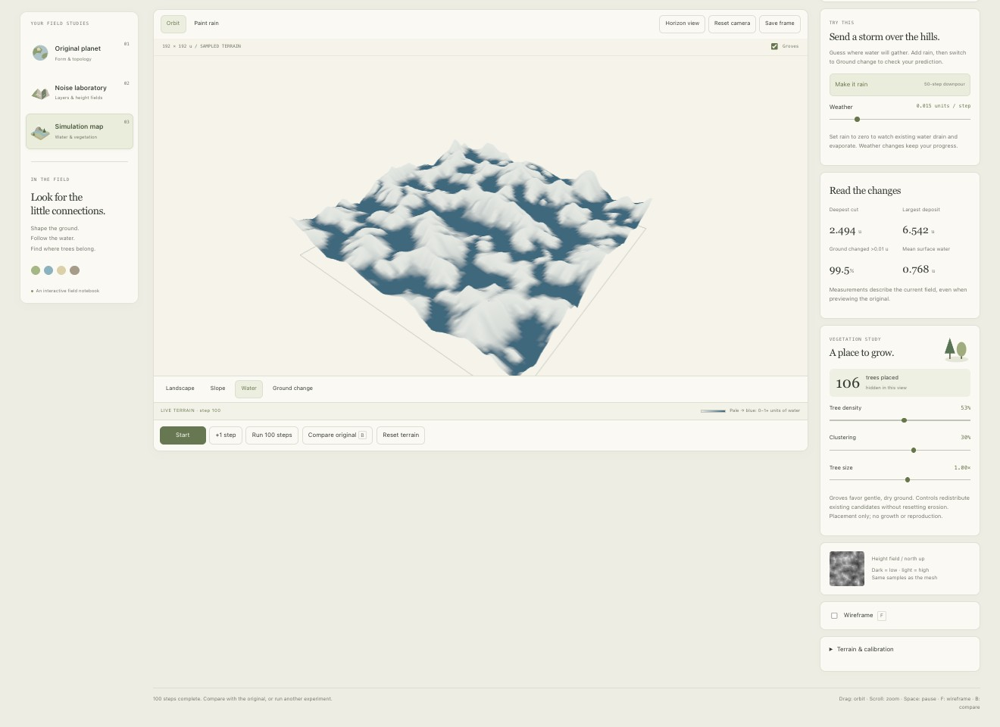

# Nature Studio — Course Progress

> Later implementation update: the new voxel, fluid and ecosystem studies are now available. See [Tutorial 12](12%20-%20Connected%20Worlds%20-%20Coast,%20Caves%20and%20Living%20Forests.md) for the current scope, screenshots and results. This note retains the earlier checkpoint and proposed experiments.
Date: 2026-10-07

**Request, translated and condensed:** Save this version with screenshots, explain the changes and experiments, connect the app to Sessions 3–7, and add tutorials and insights for the last three sessions.

This checkpoint packages the Nature Studio redesign and its learning evidence. The course mapping below follows the session titles and dates supplied by the student. These are project study notes, not a transcript of the missed lectures.

The coast screenshot uses Explore mode. Its blue sea is a level surface with depth-based coloring. It is not evidence of a new fluid solver.

## What improved, and why

The interface now has study navigation, a central viewport and grouped inspectors. Warm paper, sage accents and serif headings connect the tabs visually. The world uses its own meaningful palette: blue water, green cover, earth, rock and pale high terrain.

Simulation map adds real tree/terrain shadows, distance fog and an Explore-water highlight. These give the simple forms depth. The old Illustrated map material remains selectable for comparison. Tree density, clustering, size and the actual placed count make vegetation rules inspectable.

Both captures use the default field at step zero and the same camera setup. The redesigned layout changes the viewport width, so this is a design comparison, not a pixel-aligned shader comparison. For that comparison, use images 06 and 07 in [tutorial 08](08%20-%20Nature%20Studio,%20Shadows%20and%20Tree%20Distribution.md).

> Side note: the important change is being able to read the scene. More surface detail would not help if water and land looked alike.

## Course alignment

| Session | Evidence in this app | Parameters to study | Still required |
| --- | --- | --- | --- |
| 3 — Maps / Shaders | Seeded noise layers, linked 2D/3D previews, height/slope materials, selectable rendering | Seed, frequency, amplitude, octaves, persistence, layer order/weight, grid resolution, relief | Record a systematic frequency/resolution comparison; original planet still has its separate sine terrain |
| 4 — Sept 16 — Erosion / Biomes | Rainfall, water depth, erosion/deposition, step controls, Water/Slope/Ground change views | Rainfall, step count, resolution, relief; compare original | Land colors are illustrative. Add explicit moisture/temperature classification before claiming a biome model |
| 5 — Sept 23 — Voxels | Assignment plan and new step-by-step tutorial | Proposed: density shape, cave radius, operation order, sample spacing, chunk size, isovalue | Separate voxel tab, density slices, working mesher and measured chunking experiment |
| 6 — Sept 30 — Vector Fields / Fluids / Wind / Atmosphere | Existing erosion is a useful comparison; shader fog is appearance only | Proposed: direction, speed, swirl, fixed time step, vector-grid resolution, particle count | Actual vector field, arrows and advection; pressure-based fluids are a later stage |
| 7 — Oct 7 — Vegetation / L-systems / Ecosystems | Deterministic, terrain-constrained tree distribution with measured counts | Current: density, clustering, size. Proposed: grammar depth/angle, growth rate, dispersal and competition | Branch grammar, plant age/state, reproduction and ecological interactions |

**Coverage is not completion.** Sessions 5 and 6 are documented implementation plans. Session 7 has a working distribution foundation but no L-system or ecosystem simulation.

## Experiment A — Density changes distribution

A separate preview preserved the user's paused simulation. Fixed settings: default single Perlin layer, seed 17, frequency 2, amplitude 1, octaves 3, persistence 0.5; span 192 units, resolution 96 cells, relief 22; Hydraulic erosion at step 0, camera unchanged, Natural illustration; clustering 30%, tree size 1.00×.

| Trial | Density | Placed trees | Step / mean water / ground change |
| --- | --- | --- | --- |
| Baseline | 53% | 125 | 0 / 0.000 u / 0.0% |
| Sparse | 25% | 62 | Unchanged |
| Dense | 75% | 174 | Unchanged |
| Restore | 53% | 125 | Unchanged |

These are real browser captures at 1320 × 960. The current scene is dry, so blue water is absent for a reason. Density is an acceptance probability over eligible candidates, not an exact count target. Clustering and terrain exclusions also affect the result.

## Experiment B — Read what erosion actually changed

The earlier validation run used default rainfall 0.015 units per step and 100 steps:

| Measurement | Recorded result |
| --- | --- |
| Deepest cut | 2.494 u |
| Largest deposit | 6.542 u |
| Ground changed by more than 0.01 u | 99.5% |
| Mean surface water | 0.768 u |
| Placed trees at default density | 106 |

The inspector was scrolled during these captures. They document the same run; they are not a matched-camera before/after pair. Material, interface accent and tree-density changes preserved step 100 and the hydraulic measurements. Density zero removed the trees; restoring 53% restored 106. Water view hides trees to keep its data readable.

These values demonstrate the educational model's behavior, not a physically calibrated landscape forecast. A step is not a day. The large deposit is a reason to investigate solver behavior, not proof of realism.

## Experiments to run next — one variable at a time

### Session 3: maps and shaders

In Noise laboratory, keep seed 17 and compare Frequency 1, 2 and 4 with the other layer settings fixed. Capture both the height map and displaced surface. Then hold frequency at 4 and compare Grid resolution 32, 64 and 128. Look for changes in sampling rather than confusing a smooth shader with a detailed mesh.

Current laboratory ranges: Frequency 0.2–6, Amplitude 0–2, Octaves 1–5, Persistence 0–1, grid 16–128 segments, Displacement 0–1.5. These are not the same controls as Simulation map's resolution and relief. Octave frequency doubles internally; there is no separate lacunarity slider.

Switch Natural illustration and Illustrated map on a paused field. The geometry and solver measurements should stay fixed. Record that as a rendering test.

### Session 4: erosion and biomes

In a fresh trial, fix resolution 96 and relief 22. Reset between rainfall trials 0, 0.015 and 0.03. Capture steps 0, 25, 50 and 100 using the same camera and diagnostic scales. Rainfall zero on an initially dry field is the control case; setting it to zero after a storm is a different experiment.

Record cut, deposit, changed area and mean water. Water view uses a fixed 0–1+ u scale; Ground change saturates at ±0.5 u, so use the numerical metrics for larger changes. Slope view spans 0–60 degrees.

Resolution options are 64/96/128 cells over 192 units: spacing is 3/2/1.5 units. Changing resolution also changes numerical behavior. It is not automatically a fair physical convergence test because the solver coefficients are not calibrated to physical units.

For biomes, the next implementation should expose actual moisture and temperature fields and documented class thresholds, then connect tree suitability to them. A green material alone cannot show that this requirement is complete.

### Sessions 5–7: follow the new tutorials

- [09 — Session 5: Voxels and Spatial Density](09%20-%20Session%205%20-%20Voxels%20and%20Spatial%20Density.md)
- [10 — Session 6: Vector Fields, Fluids and Atmosphere](10%20-%20Session%206%20-%20Vector%20Fields,%20Fluids%20and%20Atmosphere.md)
- [11 — Session 7: L-systems, Growth and Ecosystems](11%20-%20Session%207%20-%20L-systems,%20Growth%20and%20Ecosystems.md)
- [Learning insights — Sessions 3 to 7](2026-10-07%20-%20Learning%20Insights%20-%20Sessions%203%20to%207.md)

These notes specify proposed controls, meaningful parameter trials and completion evidence. They do not claim that the proposed controls already exist.

## Keep the style; expand what the world can explain

The next improvements should add an inspectable cave section, wind direction and plant structure within the same interface. Keep water/soil/vegetation/rock distinct. Use toggled diagnostic overlays for density, velocity and suitability; retain fixed legends. There is no need for a new visual identity every time the data model grows.

## Validation and limits

The redesign passed the production build, lint and seven regression tests. Browser checks covered all three workspaces, a 100-step simulation, appearance/state independence and narrow layouts. This documentation update adds the density comparison above. No frame-rate benchmark has been performed. The existing large JavaScript bundle warning remains.

Current limits: 650-tree capacity; no voxel workspace, velocity solver, plant lifecycle or simulation persistence across workspace changes. Shadow resolution 2048² and fog distances 270–720 are code settings, not exposed controls. Static water marks do not show current direction.

**Next implementation:** a bounded voxel sphere and slice inspector, then a cave subtraction, before trying an infinite voxel world.
