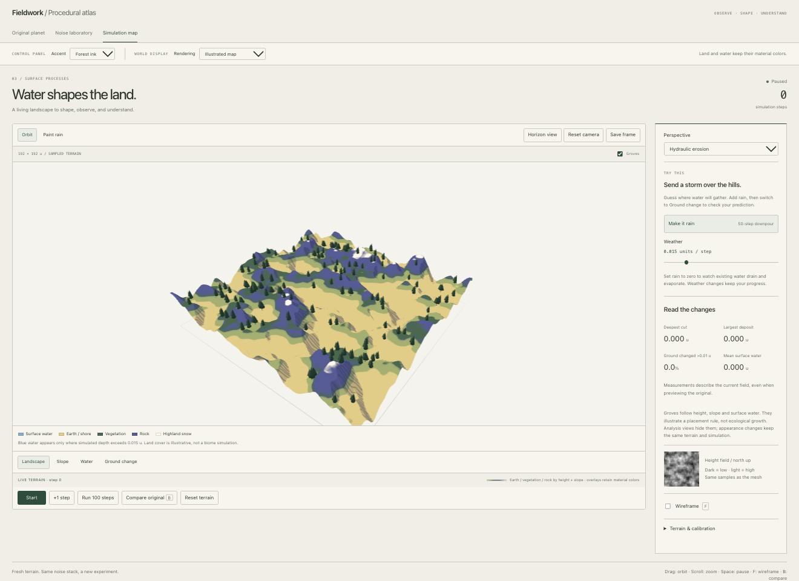
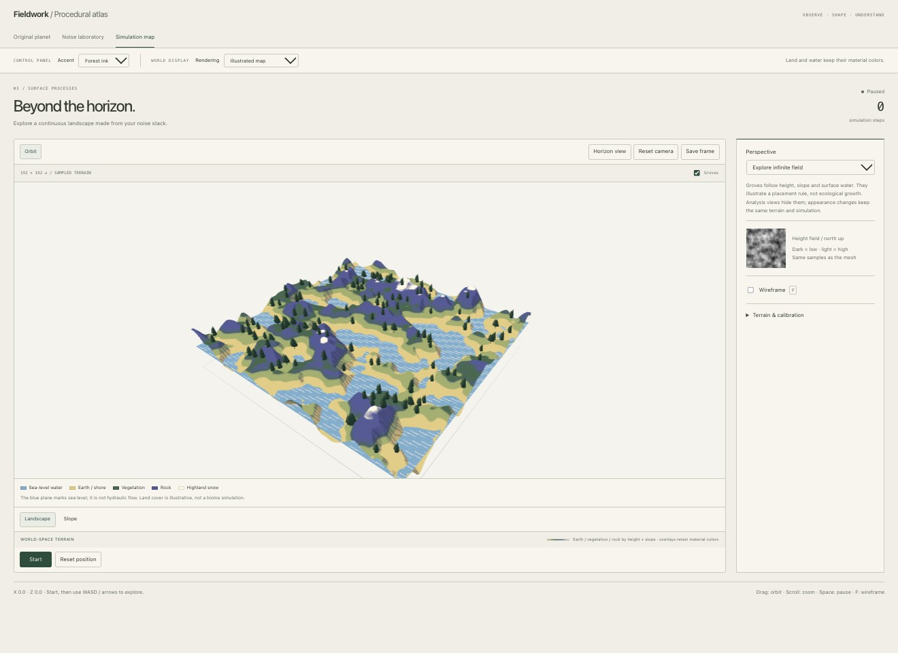
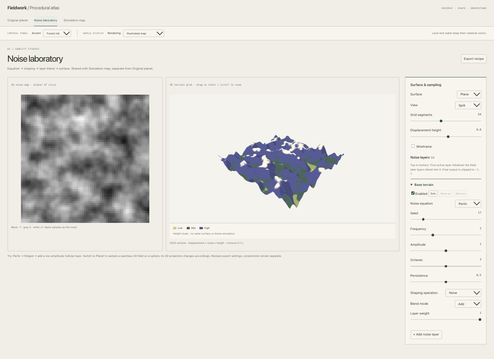
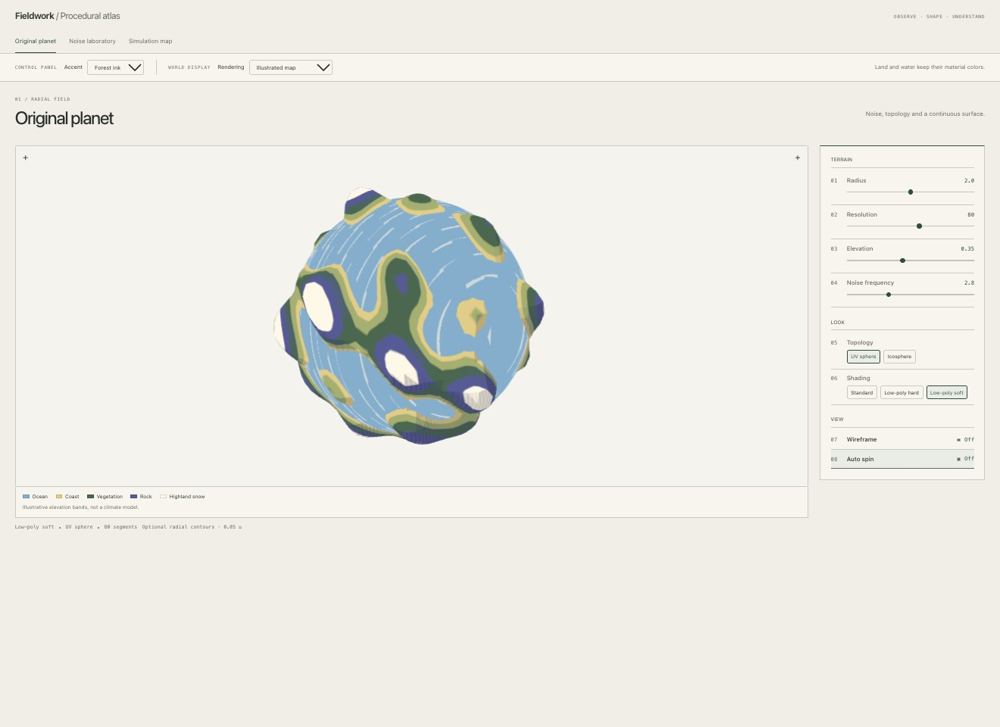
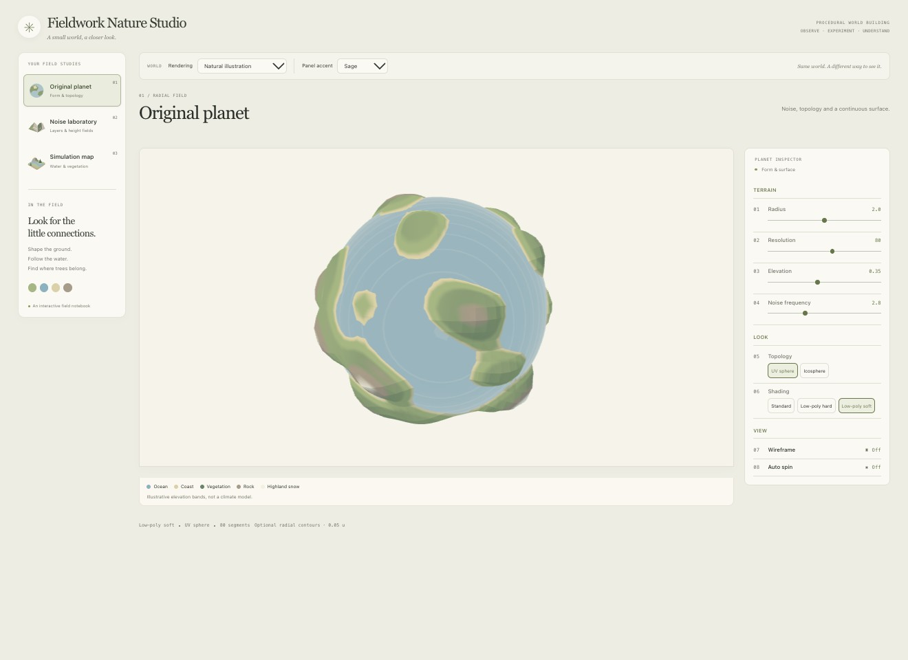
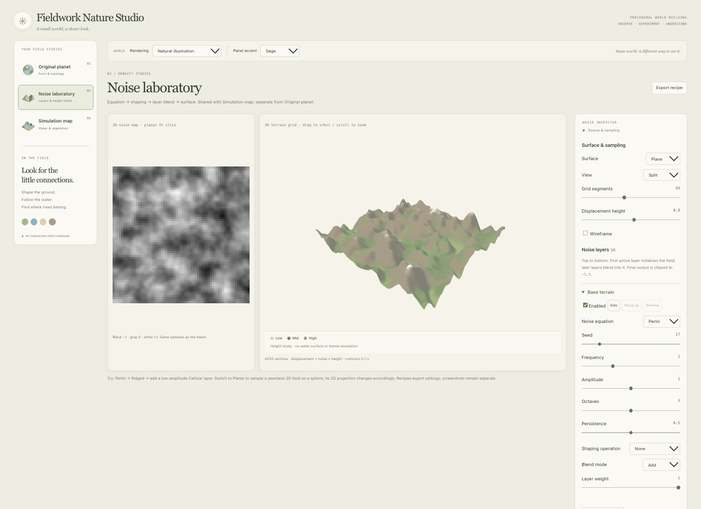
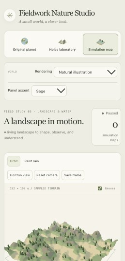
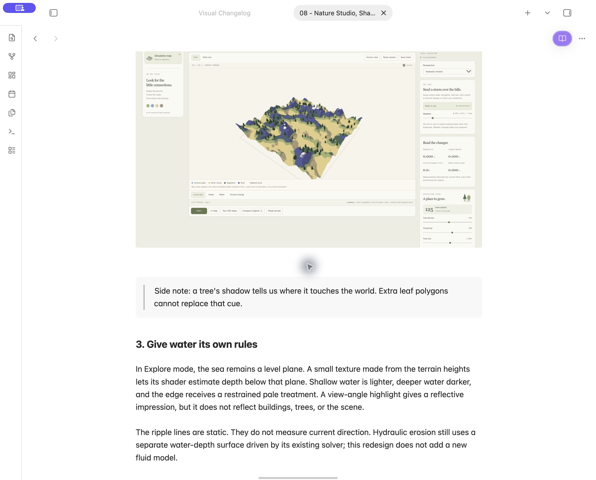
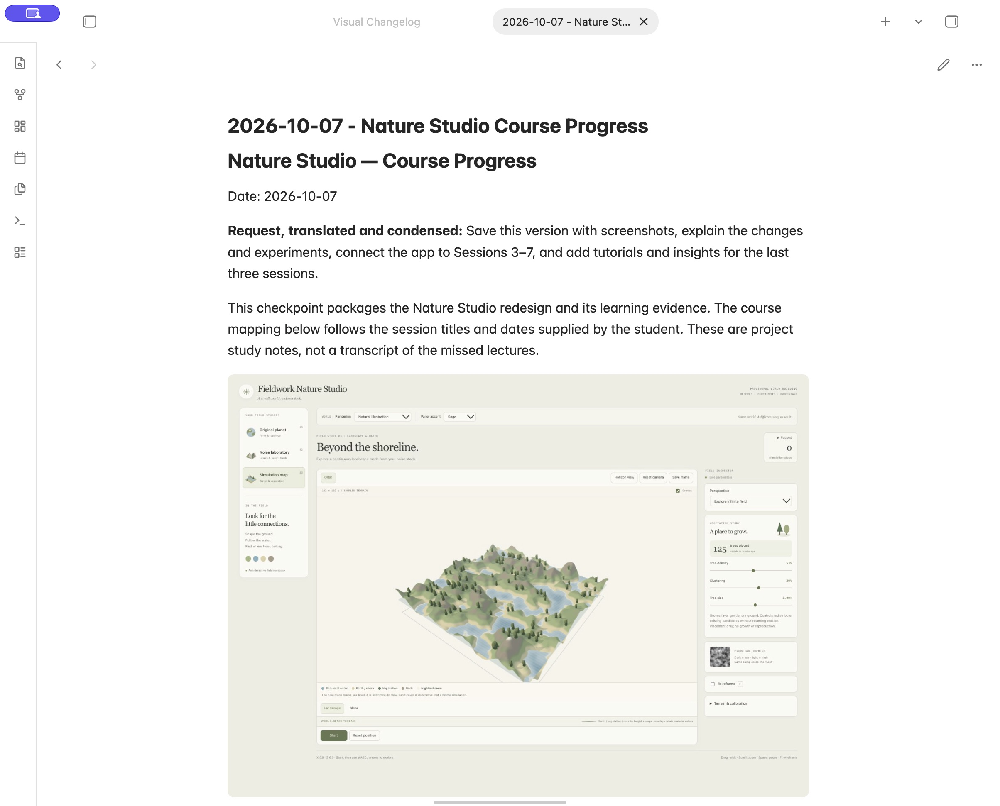

# October 7 — Illustrated world checkpoint

## Request

**User request, translated:** Save the current visual screenshots and progress to GitHub before making further changes. With the new course topics, should the art direction change? Does the current world feel too flat, and what can we learn from game shaders?

## What this checkpoint preserves

This records the existing illustrated version, including the previously uncommitted September work. No new rendering, terrain, or simulation behavior was implemented today. The warm-paper controls remain separate from the world palette. Water is blue, vegetation green, ground ochre, rocks indigo, and high terrain pale.

The app has three working tabs: Original planet, Noise laboratory, and Simulation map. Voxel terrain has an English tutorial and backlog, but no implemented tab. Vector-field weather and particle-based fluid demonstrations are also still planned.

## Current screenshots

These are fresh browser captures of the current local build, taken in a separate preview so an existing experiment would not be reset. Each JPEG is 1320 × 960. The preview used approximately 2000 × 1454 CSS pixels at the browser's existing zoom, so controls appear small. The temporary device-size override was cleared after capture. These are baseline records, not a matched before/after comparison with September images.

### 1. Hydraulic erosion — paused at step zero

The 192 × 192 unit field uses 96 × 96 cells. Groves are enabled. No rainfall steps have run; zero surface water is expected. This screenshot does not demonstrate a new erosion result.

> Side note: land-cover colors are readable. The next question is whether the hills still feel solid when those colors are less prominent.

### 2. Explore — land and sea

Paused at X = 0, Z = 0 with the default camera. The blue surface marks sea level; its white pen marks are decorative and do not measure flow. The view makes it easier to judge separation between water, shore, vegetation, and rock.

> Side note: the water reads clearly as water, but it behaves visually more like a printed pattern than a changing surface.

### 3. Noise laboratory

Plane / Split view, 64 segments, displacement 0.8. Base Perlin layer: seed 17, frequency 2, amplitude 1, three octaves, persistence 0.5, no shaping. The grayscale map and mesh use the same samples. This is a height study, not a water or biome simulation.

### 4. Original planet

Radius 2, resolution 80, elevation 0.35, frequency 2.8, UV sphere, Low-poly soft. Auto spin was switched off in the separate preview for capture. Its rotation is not a reproducible numeric camera bookmark. The planet still uses its original radial terrain function rather than the shared noise stack.

## Why the current look can feel flat

The palette and silhouettes already communicate materials. The main missing cues are spatial: trees do not cast ground shadows, distant terrain has little atmospheric separation, and water has no view-dependent reflective response. The current world shader contains directional bands and ink-like marks, but more marks alone will not resolve these gaps.

Code inspection also found that setting scene fog does not automatically apply fog to the custom terrain shader: it has no fog integration, and tree materials disable fog. A future depth study must implement and verify that behavior explicitly.

See [Visual depth review and game references](../analysis/2026-10-07%20-%20Visual%20Depth%20Review.md) for the proposed direction. These are suggestions, not completed features.

## Checks actually run

- Production build passed.
- Lint passed.
- All six simulation / landscape regression tests passed.
- All three tabs rendered in the browser; no captured console errors.
- Four current JPEG screenshots were saved and visually inspected.
- The build still reports a JavaScript bundle above 500 kB; this checkpoint does not resolve that performance warning.
- Notes were updated through the shared Obsidian Tutorials path. Image links resolved on disk at checkpoint time. The later redesign experiment below also verifies an embedded image in Obsidian.

## Next experiment — proposed

Keep this illustrated baseline and add a selectable **Atmospheric illustration** study. First test directional light, grounded tree shadows, and restrained distance haze using the same seed, camera, resolution, and simulation step. Capture a matched comparison before adding water reflections or particles. Keep the control-panel design and diagnostic color scales unchanged.

After that, use visible vector arrows and a small set of leaf or mist particles to show a velocity field. Toggle the arrows off for the expressive view. This connects the new course topic to something observable rather than adding motion with no explained cause.

---

# Experiment 2 — Nature Studio redesign

**User request, translated:** Start the redesign using the agreed world and control-panel references.

## Implemented in this iteration

- A shared Nature Studio shell: illustrated study navigation, a large central viewport and grouped inspectors. Soft paper/sage colors, serif headings, rounded cards and consistent controls follow the supplied UI references.
- A selectable **Natural illustration** world treatment across all three tabs. The older Illustrated map remains available as a material comparison.
- Simulation map now has actual directional tree/terrain shadows and shader-integrated distance fog. These are display effects; diagnostic views keep their fixed, unlit colors.
- Explore water reads a texture of the existing height samples for shallow/deep color and shore treatment. A grazing-angle highlight suggests reflection. There is no scene-reflection system, animated wave simulation or new fluid solver.
- A vegetation inspector shows the real placed count and controls density, clustering and size. Existing height/slope/wetness constraints remain. These controls preserve hydraulic state and do not implement ecological growth.
- Keyboard navigation between studies and responsive layouts for smaller screens.

The earlier GitHub checkpoint remains the full pre-redesign version. This experiment is a local preview for visual review; it has not been committed or pushed in this iteration.

## Visual record

Both use the default field, 96 cells per side, 22-unit relief, default orbit camera, default grove settings and paused step zero. Browser captures are both 1320 × 960. The layout changes the viewport width, so this is an interface-and-scene comparison, not a pixel-aligned shader comparison.

Images 06 and 07 use the same new layout, camera and paused field to compare materials. The archive selector retains the old palette and pen language, not the entire old application layout or lighting setup.

> Side note: the biggest difference is where attention goes. The controls sit around the study, and the trees now leave a mark on the ground.

Explore view, paused at the origin. Sea-level water is distinct from simulated surface water. The vegetation inspector reports 125 placed trees with the default field and controls.

These two views share the palette and lighting language. Tree shadows and scene fog are currently specific to Simulation map. Original planet retains its radial sine terrain, and Noise laboratory remains a height study without a water surface.

The mobile image is a viewport capture, not the entire scrollable page. Navigation becomes a row and the inspector follows the scene. Because the capture browser uses reduced zoom, the encoded mobile JPEG is 258 × 536, representing a 390 × 812 CSS-pixel viewport.

## Verification and observations

- Production build and lint passed. Seven regression tests passed, including a new density/placement invariance test.
- A 100-step run paused automatically: deepest cut **2.494 u**, largest deposit **6.542 u**, ground changed **99.5%**, mean water **0.768 u**.
- At that paused state, switching the world material and panel accent preserved those measurements and step 100.
- Setting density to zero gave **0 trees** without changing the hydraulic measurements. Restoring 53% density restored **106 trees** in the wet field.
- Water analysis hid trees, retained the fixed 0–1+ u depth scale, and labeled the vegetation count as hidden. A repeated run supplied the full-camera landscape capture below.
- All three tabs rendered without captured browser console errors. At 390 CSS px, Simulation map and Noise laboratory had no horizontal overflow. At 854 CSS px, the scene and inspector occupied separate columns; keyboard Home selected the first study.
- The existing large-bundle warning remains (about 807 kB minified JavaScript). No frame-time benchmark was performed, so this log makes no FPS claim.

## Learning notes and boundaries

The [new tutorial](08%20-%20Nature%20Studio,%20Shadows%20and%20Tree%20Distribution.md) explains each visual cue and the tree controls. The style guide, README, learning path and backlog have been updated in English. Tutorial edits use the shared Obsidian vault path. Tutorial 08 was opened in Obsidian and its embedded archived-material comparison rendered successfully.

Switching Simulation map perspectives or leaving the workspace still resets that experiment. Tree density controls distribution, not birth or death. Voxel terrain, wind particles, fluid vector fields and biological population dynamics remain future work.

**Next experiment:** compare a sparse grove and a clustered grove at the same paused step. Record density, clustering, count and screenshots, then explain which rule caused the difference before adding lifecycle behavior.

## Experiment 3 — Course alignment and publication checkpoint

**Request, translated and condensed:** Save this version with screenshots and explanations on GitHub. Align the app's improvements and parameters with Sessions 3–7 and add tutorials and insights for the last three sessions.

### What was added

- A [new progress report](2026-10-07%20-%20Nature%20Studio%20Course%20Progress.md) with the redesign, screenshot evidence, course mapping and parameter experiments.
- Tutorials 09–11 covering spatial density/meshing, vector fields/advection and L-systems/ecosystems; all distinguish proposed implementation from current features.
- A [separate insights note](2026-10-07%20-%20Learning%20Insights%20-%20Sessions%203%20to%207.md), plus updated reading links and backlog.
- Two real screenshots of a new density trial. The five new notes were written directly in Obsidian's shared Tutorials folder.

### Actual trial

A separate preview preserved the user's paused step-100 experiment. Default seed 17, Perlin frequency 2, amplitude 1, octaves 3, persistence 0.5; Simulation map resolution 96, relief 22, Hydraulic erosion at step 0. Clustering remained 30%, tree size 1.00× and camera/viewport stayed fixed.

| Density | Actual count |
| --- | --- |
| 53% baseline | 125 |
| 25% | 62 |
| 75% | 174 |
| 53% restored | 125 |

Ground-change and water metrics remained zero; no simulation step advanced. Density changes candidate acceptance, not birth or growth rates.

### Scope and next experiment

This is a documentation/publication checkpoint for the Nature Studio redesign, with a new parameter trial. It does not add voxel, wind or L-system features. The Session 3/4 experiments in the new report are recipes still to run; the documented 100-step run and density trial are observed evidence.

Next: implement one bounded voxel sphere and its density slice, then test a cave subtraction. Retain the current visual style while making each new data model inspectable.

### Checkpoint checks

Production build, lint and all seven simulation/placement tests passed again. The existing 807.49 kB JavaScript bundle warning remains. Local Markdown targets and screenshot file signatures were checked; submission text contains no Chinese passages. The report and embedded image were verified in Obsidian reading mode.

