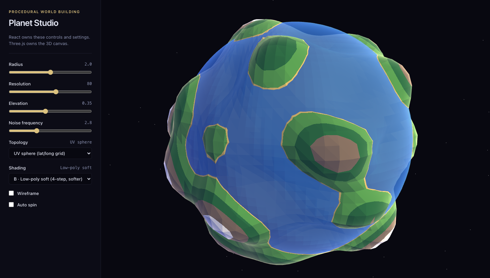
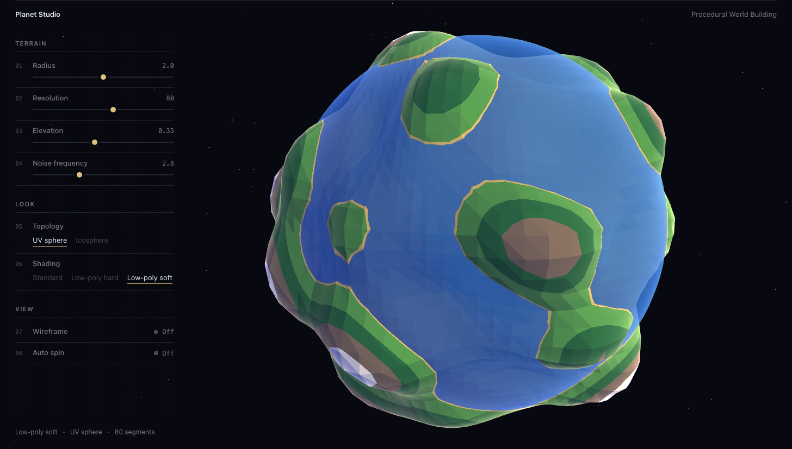
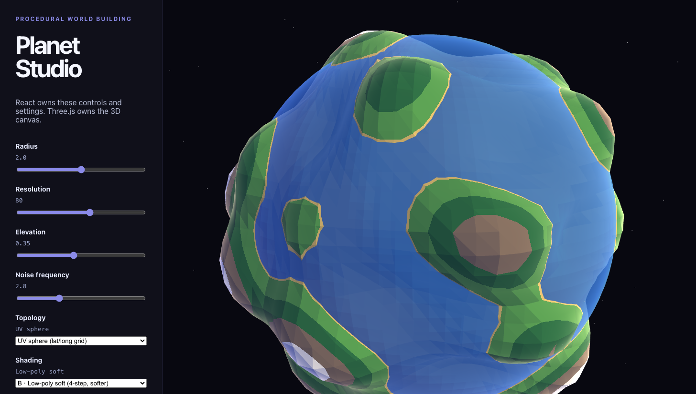
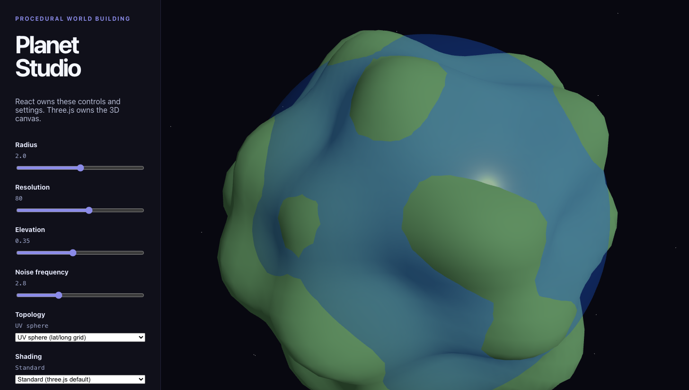
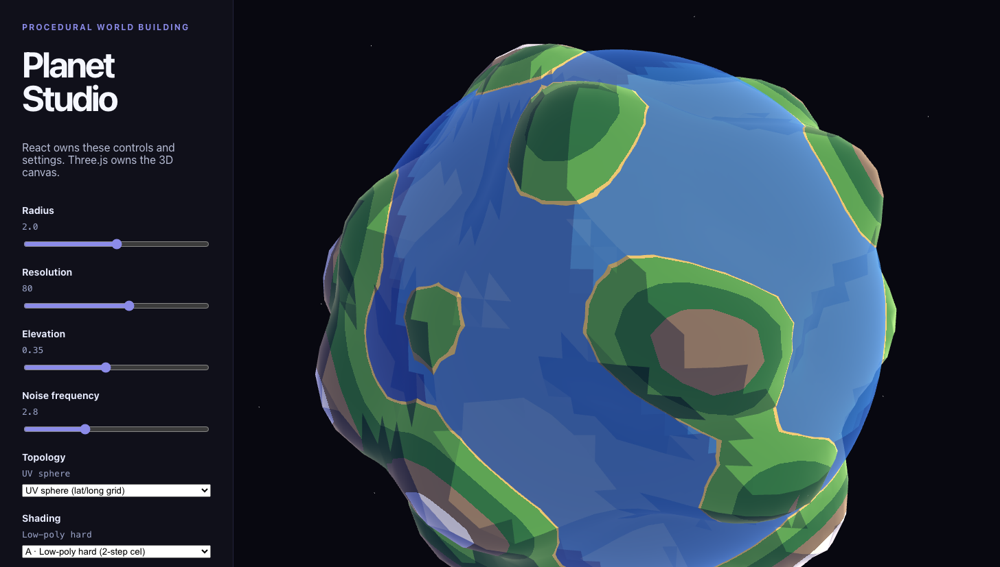
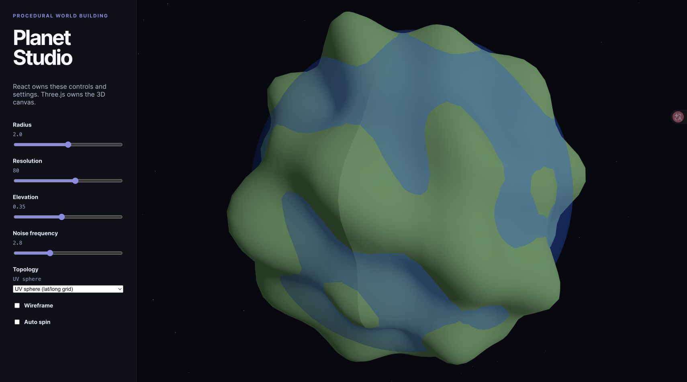
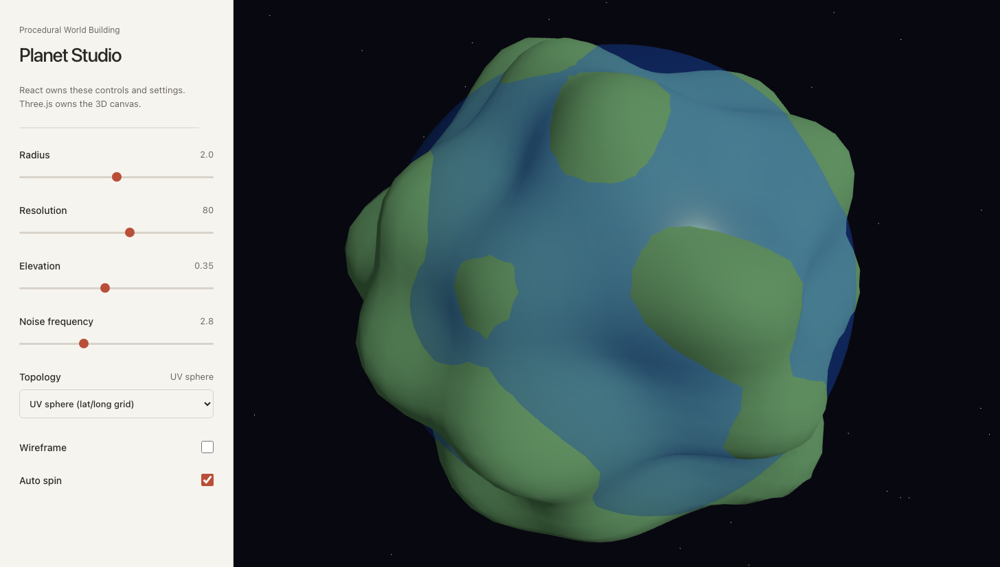

# Visual Changelog

Every visual change to Planet Studio gets an entry here: a before/after pair, what changed, and why. Newest entries on top. Design direction lives in [STYLE-GUIDE](../../STYLE-GUIDE.md); this file is the evidence that we're actually moving toward it.

## How to add an entry

1. **Before** — capture a screenshot *before* touching the code (or reuse the previous entry's "after").
2. Make the change.
3. **After** — capture again with the same size and camera angle so the diff is honest.
4. Drop both into `images/ui-style/` with descriptive names, add an entry below.

Repeatable capture command (dev server must be running):

```bash
"/Applications/Google Chrome.app/Contents/MacOS/Google Chrome" --headless=new --disable-gpu --enable-unsafe-swiftshader --screenshot="$HOME/Documents/GitHub/Procedural-World-Building/docs/tutorials/images/ui-style/NAME.png" --window-size=1456,827 --hide-scrollbars --virtual-time-budget=20000 http://localhost:5173
```

---

## 004 — Floating controls, full-bleed world · 2026-09-08

**Goal:** borrow the *feel* of editorial portfolio sites (subdivision.work was the reference) — thin rules, small type, big empty space, dim/bright hierarchy — **without** turning a tool into a poster. Every control stays visible, labelled, and easy to grab.

| Before (panel v2) | After (v3 floating) |
|---|---|
|  |  |

**What changed (`App.tsx` markup + `App.css`):**

- The sidebar is gone as a *surface*. The planet is full-bleed; the controls float over it in a 300px column with only a faint left-to-right darkening so text stays legible over bright terrain
- One hairline across the top, wordmark left, course name right — the only "chrome" on the page
- Controls grouped **Terrain / Look / View** with hairline headers, and every row carries a small index `01…08` — the reference's "numbered list" feel, doing real work as a reading aid
- Rows rest at 50 % opacity and light up on hover/focus. That's the whole hierarchy system: no cards, no boxes
- Sliders are now hairlines (2px track, 10px sand thumb that grows on hover). Still a real `<input type=range>` — keyboard arrows work, focus ring is ocean-blue
- `<select>` → inline text choices (`UV sphere · Icosphere`), active one underlined in sand. Proper `role=radio`, large hit area
- Checkboxes → text switches with a dot indicator and an explicit On/Off word, `role=switch`
- Camera view offset nudges the planet ~150px right on desktop so the column never covers it
- Bottom-left status line: current look · topology · segments

**What I deliberately did *not* copy:** the giant centred title, corner year labels, hover-to-reveal lists. Those are for browsing eight projects, not for dragging a slider forty times.

> the reference is a gallery; mine is an instrument panel. what transfers is the *restraint* — one rule, one accent, one weight — not the layout. once I stopped trying to make it look like the screenshot and asked "what does the reference do to make things feel light?" the answer was mostly "remove backgrounds and dim what you're not touching". that's usable.

**Status:** ✅ kept. Next visual work goes back to the world (real noise → taller mountains → snow line, then atmosphere).

---

## 003 — Panel follows the world · 2026-09-08

**Goal:** B is the world's look now (see 002), so the panel gets a *small* restyle so the two stop feeling like different apps. Dark stays. Every panel colour is lifted from the shader palette.

| Before (old panel + B) | After (panel v2 + B) |
|---|---|
|  |  |

**What changed (`app/src/App.css` only):**

- Palette as CSS variables, taken from the scene: `--space` background, **`--sand #dcc27f`** as the *single* accent (the beach line colour → slider thumbs, checkboxes, eyebrow), `--ocean #4a86e6` only for keyboard focus rings
- Purple is gone — it was the one colour that existed nowhere in the world
- Headline 52px → 26px; the panel narrows 340 → 300px; *let the world lead*
- Slider values sit inline on the right with tabular numerals, so nothing jumps while dragging
- Selects and checkboxes get the same dark surface + hairline border instead of browser defaults

> the trick that made it click: pick the accent *from* the render, not from a palette site. the sand thumb next to the sand coastline — you don't notice it consciously, it just stops looking pasted-on.

**Status:** ✅ kept. This is the baseline for future entries.

---

## 002 — Stylized world shader, first pass · 2026-09-08

**Goal:** give the *world* its look before touching the panel again (lesson from 001). A custom `ShaderMaterial` replaces the default `MeshStandardMaterial` for land and ocean. Two flavours to choose between, selectable from a new **Shading** dropdown (or `?shading=lowpoly-hard` / `?shading=lowpoly-soft` in the URL).

| Standard (before) | A · Low-poly hard | B · Low-poly soft |
|---|---|---|
|  |  |  |

**What the shader does (`app/src/App.tsx`):**

- **Flat shading** — the fragment shader rebuilds the face normal from screen-space derivatives (`dFdx`/`dFdy` of world position), so every triangle gets one colour. No geometry change needed.
- **Elevation colour bands** — sand → grass → forest → rock → snow, hard `step()` edges, driven by `length(position) - radius` normalised by the Elevation slider.
- **Toon lighting** — diffuse quantised into *N* steps: A = 2 steps, near-zero blend; B = 4 steps, wide `smoothstep` blend.
- **Coloured shadow** — the dark side is tinted blue-violet, the lit side warm, instead of black/white.
- **Rim light** — fresnel on the smooth normal; warm on land, cool on water. Reads well against black space and is the seed for a future atmosphere.
- Ocean uses the same shader with a flat blue albedo, 82% opacity.

Same camera, same seed, spin frozen (`&spin=0`) so the three are comparable.

**Observations:**

> the *shape* didn't change at all and it suddenly looks like a place. the sand line around every coast is doing a lot — it reads as "beach" instantly.
> A is punchier and more graphic; B keeps more of the roundness because the 4 light steps trace the sphere. the ocean in A shows visible facets (it's a 96×48 sphere being flat-shaded) — either a feature or the first thing to fix depending on which way we go.
> snow only shows on the very highest peaks right now. with real noise later the mountains will be taller and it should show up more.

**Status:** ✅ **B chosen** — now the default shading. A and Standard stay in the dropdown for comparison. Panel restyle to match: see 003.

---

## 001 — Editorial panel restyle · 2026-09-08

**Goal:** first pass at the [STYLE-GUIDE](../../STYLE-GUIDE.md) direction — *minimal editorial interface × stylized miniature world*. Panel only; the 3D scene is untouched.

| Before | After |
|---|---|
|  |  |

**What changed (`app/src/App.css` only):**

- Dark navy sidebar (`#10101a`) → warm paper surface (`#f6f4ef`) with ink text (`#292823`)
- One deliberate accent: terracotta (`#b94f38`) for slider thumbs and the active checkbox
- The huge display-size "Planet Studio" headline stepped down to a quiet 28px — *let the world lead*
- Uppercase letter-spaced eyebrow → plain small text; added a hairline rule to separate intro from controls
- Slider values moved inline, right-aligned next to their labels

**Why:** the old panel competed with the planet — big type, saturated purple, same darkness as space. The new panel reads as "instrument", the canvas reads as "world".

> side note: the planet instantly looks MORE colorful next to the paper panel even though not a single scene value changed. contrast is doing all the work here.

**Verdict: ❌ rejected, reverted to the dark panel** (2026-09-08)

> looked at it next to the scene and… no. the paper panel is pretty on its own but it has nothing to do with the black low-poly space vibe behind it — it feels like a settings page from a different app got pasted onto my planet. and honestly the real problem isn't the panel at all: the *world* still looks like default three.js. I wanted a stylized world — shader-driven color and expressive light/shadow — and no amount of panel restyling gets me there.

**What I learned:**
- Don't restyle the UI before the world has its look. The panel should *follow* the scene, not lead it.
- "Minimal" doesn't have to mean light/paper. Dark + minimal + one accent that comes from the world's palette is the direction.
- Next visual entry must be scene-side: stylized shading first, panel second.

The rejected CSS is kept at `docs/analysis/rejected/panel-editorial-v1.css` for reference.
